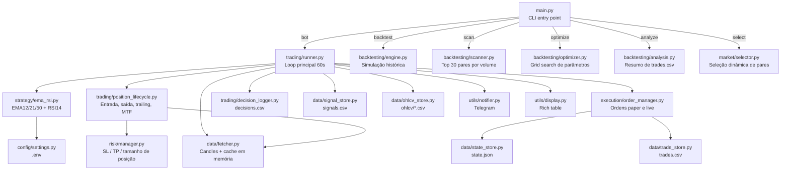
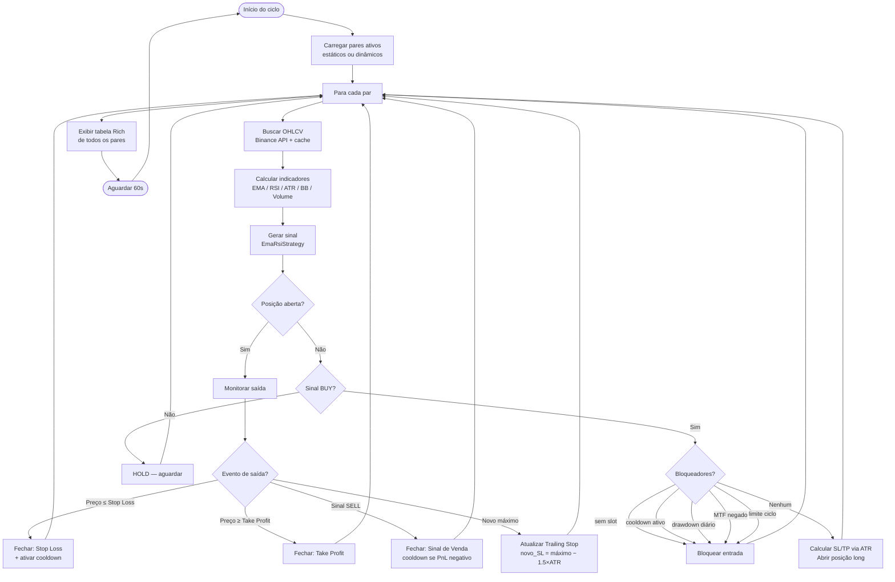
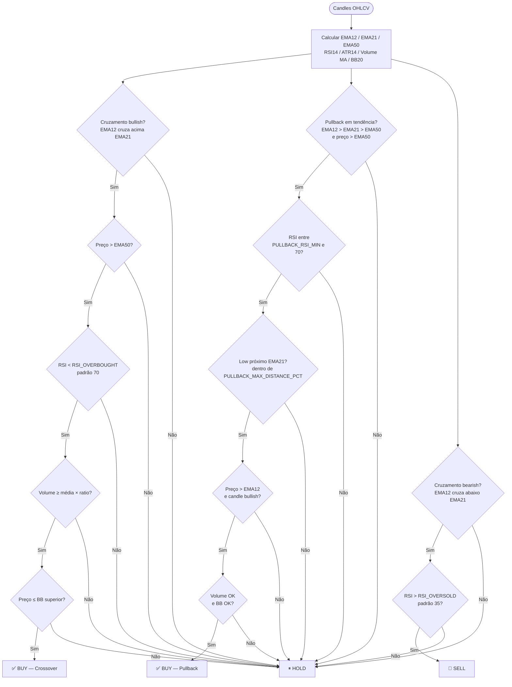
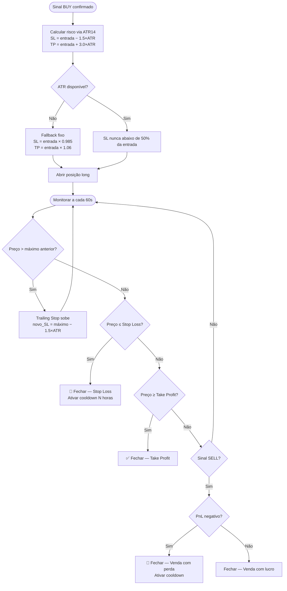

# Crypto Day Trader Bot

Bot de trading algorítmico para cripto em Python. Conecta na Binance via API, calcula indicadores técnicos e opera automaticamente com gestão de risco embutida.

---

## Funcionalidades

- Estratégia EMA crossover (12/21) com filtro de tendência EMA50 + RSI
- Entrada por pullback em tendência (além do crossover)
- Stop Loss dinâmico via ATR14 + Trailing Stop automático
- Take Profit dinâmico via ATR14
- Modo **paper trading** (simulado) e **live trading**
- Multi-par: monitora até 30 pares simultaneamente
- Confirmação multi-timeframe (MTF) antes de abrir posição
- Cooldown automático após stop loss
- Limite de drawdown diário (suspende novas entradas)
- Backtest com métricas completas (Sharpe, profit factor, win rate, drawdown)
- Relatório de vantagem contra buy-and-hold (`python main.py edge`)
- Otimização de parâmetros (`python main.py optimize`)
- Gráfico interativo no browser com Dash/Plotly (`python main.py chart`)
- Seleção dinâmica de pares por liquidez, spread, volatilidade e backtest
- Persistência completa: trades, sinais, candles e estado salvos em disco
- Recuperação automática de estado após restart
- Alertas e relatório diário via Telegram

---

## Arquitetura do projeto



---

## Fluxo do ciclo do bot



---

## Lógica de geração de sinal



---

## Ciclo de vida da posição



---

## Estratégia — EmaRsiStrategy

**Indicadores calculados:**

| Indicador | Parâmetro | Uso |
|---|---|---|
| EMA rápida | `EMA_FAST=9` | Sinal de cruzamento |
| EMA lenta | `EMA_SLOW=21` | Sinal de cruzamento |
| EMA tendência | `EMA_TREND=50` | Filtro de tendência |
| RSI | `RSI_PERIOD=14` | Filtro de sobrecompra/sobrevenda |
| ATR | `14` | Cálculo dinâmico de SL/TP |
| MACD diff | padrão `ta` | Logado, não usado no sinal |
| Volume MA | `VOLUME_MA_PERIOD=20` | Filtro de volume mínimo |
| Bollinger Bands | `BB_PERIOD=20`, `BB_STD=2.0` | Filtro de sobreextensão |

**Regras de entrada/saída:**

| Sinal | Condição |
|---|---|
| **BUY (crossover)** | EMA12 cruza acima EMA21 **e** preço > EMA50 **e** RSI < `RSI_OVERBOUGHT` **e** volume ≥ média×`VOLUME_MIN_RATIO` **e** preço ≤ BB superior **e** MTF confirmado |
| **BUY (pullback)** | EMA12 > EMA21 > EMA50 **e** preço > EMA50 **e** RSI entre `PULLBACK_RSI_MIN`–`RSI_OVERBOUGHT` **e** low próximo EMA21 **e** preço > EMA12 **e** candle bullish **e** volume OK **e** BB OK |
| **SELL** | EMA12 cruza abaixo EMA21 **e** RSI > `RSI_OVERSOLD` |
| **HOLD** | nenhuma das condições acima |

---

## Gestão de risco

| Parâmetro | Fórmula | Padrão |
|---|---|---|
| Tamanho da ordem | `min(MAX_ORDER_SIZE_USDT, saldo × 0.95)` | $100 |
| Stop Loss (ATR) | `entrada − ATR_SL_MULTIPLIER × ATR14` | 1.5× ATR |
| Take Profit (ATR) | `entrada + ATR_TP_MULTIPLIER × ATR14` | 3.0× ATR |
| Stop Loss (fallback) | `entrada × (1 − STOP_LOSS_PCT)` | −1.5% |
| Take Profit (fallback) | `entrada × (1 + TAKE_PROFIT_PCT)` | +6.0% |
| SL mínimo absoluto | nunca abaixo de 50% da entrada | — |
| Risk/reward ratio | 1:2 (1.5× ATR risco / 3.0× ATR alvo) | — |
| Trailing Stop | `máximo − 1.5×ATR` a cada novo topo | — |
| Drawdown diário | suspende entradas se PnL diário < −`DAILY_DRAWDOWN_LIMIT` | −5% |
| Cooldown pós-SL | bloqueia reentrada no par por `COOLDOWN_HOURS` | 2h |
| Max posições simultâneas | `MAX_POSITIONS` | 10 |
| Max entradas por ciclo | `MAX_ENTRIES_PER_CYCLE = 1` | 1 |

---

## Instalação

```bash
# 1. Clonar
git clone <repo-url>
cd itgr

# 2. Criar ambiente virtual
python -m venv .venv
.venv\Scripts\activate        # Windows
# source .venv/bin/activate   # Linux/Mac

# 3. Instalar dependências
pip install -r requirements.txt

# 4. Configurar credenciais
cp .env.example .env
# edite .env com suas API keys da Binance
```

### Ambiente de desenvolvimento

```bash
# dependências extras (ruff, mypy, pytest-cov, pre-commit)
pip install -r requirements-dev.txt

# hooks de lint/type-check/teste antes de cada commit
pre-commit install

# rodar manualmente
ruff check .
mypy
pytest
```

---

## Configuração (.env)

| Variável | Padrão | Descrição |
|---|---|---|
| `BINANCE_API_KEY` | — | API key da Binance |
| `BINANCE_API_SECRET` | — | API secret da Binance |
| `TRADING_MODE` | `paper` | `paper` (simulado) ou `live` (real) |
| `LIVE_TRADING_CONFIRMATION` | — | Obrigatório para live: `I_UNDERSTAND_LIVE_TRADING_RISK` |
| `PAIRS` | `BTC/USDT,...` | Lista de pares separados por vírgula |
| `BLACKLIST_PAIRS` | — | Pares ou bases bloqueadas: ex. `USDC/USDT,FDUSD` |
| `TIMEFRAME` | `1h` | Timeframe dos candles (`1h`, `4h`, `1d`) |
| `MAX_ORDER_SIZE_USDT` | `100.0` | Teto por ordem em USDT |
| `MAX_POSITIONS` | `10` | Máximo de posições abertas simultaneamente |
| `STOP_LOSS_PCT` | `0.015` | Stop loss fixo — fallback sem ATR (1.5%) |
| `TAKE_PROFIT_PCT` | `0.06` | Take profit fixo — fallback sem ATR (6%) |
| `ATR_SL_MULTIPLIER` | `1.5` | Multiplicador ATR para stop loss |
| `ATR_TP_MULTIPLIER` | `3.0` | Multiplicador ATR para take profit |
| `EMA_FAST` | `9` | Período EMA rápida |
| `EMA_SLOW` | `21` | Período EMA lenta |
| `EMA_TREND` | `50` | Período EMA de tendência |
| `RSI_PERIOD` | `14` | Período do RSI |
| `RSI_OVERSOLD` | `35` | RSI mínimo para sinal de venda |
| `RSI_OVERBOUGHT` | `70` | RSI máximo para entrada |
| `VOLUME_MA_PERIOD` | `20` | Janela da média de volume |
| `VOLUME_MIN_RATIO` | `1.0` | Volume mínimo = média × ratio para BUY |
| `BB_PERIOD` | `20` | Período das Bollinger Bands |
| `BB_STD` | `2.0` | Desvios padrão das Bollinger Bands |
| `PULLBACK_ENTRY_ENABLED` | `true` | Ativa entrada por pullback em tendência |
| `PULLBACK_RSI_MIN` | `45` | RSI mínimo para entrada por pullback |
| `PULLBACK_MAX_DISTANCE_PCT` | `0.02` | Distância máxima do preço à EMA lenta no pullback (2%) |
| `MTF_TIMEFRAME` | `4h` | Timeframe de confirmação de tendência (multi-timeframe) |
| `COOLDOWN_HOURS` | `2` | Horas de bloqueio de reentrada após stop loss |
| `DAILY_DRAWDOWN_LIMIT` | `0.05` | Limite de perda diária (5% = suspende entradas) |
| `DAILY_REPORT_HOUR` | `0` | Hora (0–23) para enviar relatório diário via Telegram |
| `DYNAMIC_PAIRS_ENABLED` | `false` | Seleciona pares automaticamente ao iniciar |
| `DYNAMIC_PAIRS_TOP_N` | `5` | Número de pares dinâmicos a selecionar |
| `DYNAMIC_PAIRS_CANDIDATES` | `20` | Candidatos avaliados na seleção dinâmica |
| `MIN_VOLUME_USDT` | `10000000` | Volume mínimo diário em USDT para seleção dinâmica |
| `MAX_SPREAD_PCT` | `0.003` | Spread máximo permitido (0.3%) |
| `MIN_VOLATILITY_PCT` | `1.0` | Volatilidade mínima diária (%) |
| `BACKTEST_FEE_RATE` | `0.001` | Taxa de corretagem no backtest (0.1%) |
| `BACKTEST_SLIPPAGE_PCT` | `0.0005` | Slippage simulado no backtest (0.05%) |
| `TELEGRAM_BOT_TOKEN` | — | Token do bot Telegram (opcional) |
| `TELEGRAM_CHAT_ID` | — | Chat ID Telegram (opcional) |

> **Permissões necessárias na Binance:** Leitura + Trading Spot. **Nunca habilite saques.**

---

## Comandos

| Comando | Descrição |
|---|---|
| `python main.py` | Inicia o bot (padrão) |
| `python main.py bot` | Inicia o bot multi-par |
| `python main.py status` | Preço atual, saldo e posições abertas |
| `python main.py backtest` | Backtest no par principal (`PAIRS[0]`) |
| `python main.py edge` | Relatório de vantagem estatística contra buy-and-hold |
| `python main.py multibacktest` | Backtest em lista fixa de pares |
| `python main.py scan` | Backtest nos top 30 pares por volume na Binance |
| `python main.py analyze` | Analisa `data/trades.csv` e gera relatório de desempenho |
| `python main.py optimize` | Grid search de parâmetros EMA/RSI/ATR/BB/Volume |
| `python main.py select` | Seleciona pares por liquidez, spread, volatilidade e backtest |
| `python main.py chart [PAR] [TF]` | Gráfico interativo no browser (Dash/Plotly) |

---

## Persistência de dados

| Arquivo | Formato | Conteúdo |
|---|---|---|
| `data/decisions.csv` | CSV | Cada ciclo por par: sinal, decisão, bloqueios, filtros e indicadores |
| `data/signals.csv` | CSV | Mudanças de sinal: timestamp, preço, EMA/RSI/MACD |
| `data/trades.csv` | CSV | Cada trade fechado: entrada, saída, PnL, motivo |
| `data/ohlcv/BTCUSDT_1h.csv` | CSV | Candles históricos acumulados por par/TF |
| `data/state.json` | JSON | Estado atual: saldo, posições abertas, contadores |
| `logs/YYYY-MM-DD.log` | texto | Log completo do dia |
| `logs/events-YYYY-MM-DD.jsonl` | JSONL | Eventos estruturados: ordens, erros, ciclo |

O bot **restaura estado automaticamente** ao reiniciar — posição aberta e saldo paper preservados.

---

## Cache de candles

`data/fetcher.py` mantém cache em memória (`_cache` dict):
- **Primeira chamada:** busca `CANDLE_LIMIT=100` candles (~5s por par desde o Brasil)
- **Chamadas seguintes:** busca apenas os últimos 5 candles e faz merge
- Resultado: latência quase zero após warm-up inicial

---

## Estrutura do projeto

```
├── main.py                    # CLI entry point
├── bot.py                     # Wrapper de compatibilidade
├── config/
│   └── settings.py            # Todas as configs lidas do .env
├── data/
│   ├── fetcher.py             # OHLCV + ticker via ccxt, cache em memória
│   ├── paths.py               # Caminhos dos arquivos locais
│   ├── trade_store.py         # Trades fechados
│   ├── signal_store.py        # Mudanças de sinal
│   ├── decision_store.py      # Decisões por ciclo/par
│   ├── state_store.py         # Estado atual (state.json)
│   ├── ohlcv_store.py         # Candles acumulados
│   ├── trade_logger.py        # Compatibilidade com imports antigos
│   └── ohlcv/                 # Candles históricos (CSV por par/TF)
├── strategy/
│   ├── base.py                # BaseStrategy + dataclasses Signal/TradeSignal
│   ├── diagnostics.py         # Diagnóstico de sinais e checklist
│   └── ema_rsi.py             # Estratégia EMA12/21/50 + RSI14
├── trading/
│   ├── runner.py              # Loop principal do bot (poll 60s)
│   ├── decision_logger.py     # Histórico analítico decisions.csv
│   └── position_lifecycle.py  # Entrada, saída, trailing, MTF
├── risk/
│   └── manager.py             # SL / TP / tamanho de posição via ATR
├── execution/
│   └── order_manager.py       # Ordens paper e live; persiste state; restaura ao reiniciar
├── backtesting/
│   ├── engine.py              # Motor de backtest histórico
│   ├── multi.py               # Backtest em lista fixa de pares
│   ├── scanner.py             # Scan top 30 pares por volume
│   ├── optimizer.py           # Grid search de parâmetros
│   └── analysis.py            # Análise de trades.csv
├── market/
│   ├── selector.py            # Seleção dinâmica de pares
│   └── commands.py            # Comando selecionar
├── tests/                     # Testes pytest
└── utils/
    ├── display.py             # Rich: tabela multi-par, formatação de preços
    ├── logger.py              # Logger colorido + arquivo em logs/
    └── notifier.py            # Alertas via Telegram
```

---

## Como adicionar uma nova estratégia

1. Criar `strategy/minha_estrategia.py` herdando `BaseStrategy`
2. Implementar `calculate_indicators(df: pd.DataFrame) -> pd.DataFrame`
3. Implementar `generate_signal(df: pd.DataFrame) -> TradeSignal`
4. Trocar a instância em `trading/runner.py` e `backtesting/engine.py`

```python
from strategy.base import BaseStrategy, TradeSignal, Signal

class MinhaEstrategia(BaseStrategy):
    def calculate_indicators(self, df):
        # adicionar colunas ao df
        return df

    def generate_signal(self, df):
        # retornar TradeSignal(Signal.BUY/SELL/HOLD, price, reason)
        ...
```

---

## Dependências principais

| Pacote | Uso |
|---|---|
| `ccxt` | Conexão com Binance (OHLCV, ordens, saldo) |
| `pandas` | Manipulação de séries temporais |
| `ta` | Indicadores técnicos (EMA, RSI, MACD, ATR, BB) |
| `python-dotenv` | Leitura do `.env` |
| `colorlog` | Logs coloridos no terminal |
| `rich` | Tabela multi-par e display no terminal |
| `requests` | Notificações Telegram |

---

## Rodar em servidor (produção)

```bash
# Manter rodando após fechar terminal (Linux/Mac)
nohup python main.py > /dev/null 2>&1 &

# Ver se está rodando
ps aux | grep main.py

# Parar
kill <PID>

# Alternativa com systemd ou screen
screen -S trader
python main.py
# Ctrl+A, D para desanexar
```

Para produção, recomenda-se VPS dedicada (Oracle Cloud gratuito, DigitalOcean ~$4/mês).

---

## Aviso de risco

> Trading algorítmico envolve risco de perda de capital. Use `TRADING_MODE=paper` para validar a estratégia antes de operar com dinheiro real. Nunca invista mais do que pode perder. Resultados passados não garantem resultados futuros.
