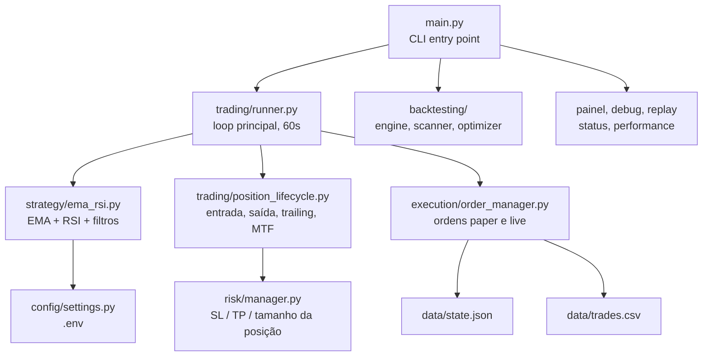

# Nautilus

**Laboratório de pesquisa sobre trading algorítmico de criptomoedas — não um produto de geração de renda.** Este repositório existe para responder uma pergunta, com disciplina empírica: *existe vantagem sistemática, real e capturável por um operador solo pequeno, em algum mecanismo de trade de cripto?* A resposta atual, depois de 41 hipóteses testadas com dados reais, é **não** — ver [Estado da pesquisa](#estado-da-pesquisa-2026-09-06) abaixo antes de considerar rodar isto com dinheiro real.

## O que este projeto é (e não é)

- **É** uma infraestrutura completa de backtest, validação fora da amostra, walk-forward e execução paper — construída pra testar hipóteses de trade com rigor, não pra "achar" que uma estratégia funciona.
- **É** um registro público e honesto de todo experimento rodado, aprovado ou não — `docs/research/registro-de-hipoteses.md` é a fonte da verdade, não este README.
- **Não é** uma ferramenta com vantagem comprovada. Nenhuma das estratégias implementadas (EMA/RSI, breakout, grid, funding rate, arbitragem, aprendizado supervisionado, e mais 30+ variantes) foi aprovada pelo próprio critério do projeto.
- **Nunca operou dinheiro real com fins lucrativos.** Tudo o que rodou foi `TRADING_MODE=paper` ou backtest — o código de execução `live` existe e é testado, mas nenhuma estratégia daqui tem autorização (nem técnica nem de decisão do operador) para usá-lo.

## Estado da pesquisa (2026-09-06)

**41 hipóteses testadas, 0 aprovadas.** Quatro famílias de mecanismo, testadas de forma metodologicamente independente, convergiram pro mesmo resultado:

| Família | Exemplos | Resultado |
|---|---|---|
| Direcional (prevê preço) | EMA/RSI, breakout, aprendizado supervisionado, sazonalidade | Sinal estatístico às vezes real, nunca sobrevive a custo de execução |
| Carry delta-neutro | Funding rate (spot-perp, perp-perp, futuros trimestrais) | Prêmio real, mas abaixo do custo de oportunidade após correção de capital |
| Arbitragem pura | Triangular, entre corretoras | Zero oportunidades em ~600 observações reais |
| Estrutural | Cointegração, sinal on-chain, grid trading, PCA/eigenportfolio | Cada uma reprovada por um mecanismo diferente |

Essa conclusão não ficou só entre as paredes deste repositório. Pesquisa externa, incluindo o **agregado real e auditado de centenas de fundos profissionais de trade quant/algorítmico em cripto desde 2017**, mostra a indústria inteira perdendo pra simplesmente comprar e segurar Bitcoin no mesmo período. Um estudo acadêmico brasileiro (Chague, De-Losso, Giovannetti — B3/FGV) sobre day traders de varejo encontrou que 97% de quem persiste mais de 300 dias perde dinheiro, e mais tempo operando não melhora o resultado. Nenhum bot comercial ou open source pesquisado (3Commas, Cryptohopper, Freqtrade, Hummingbot, etc.) tem prova de lucro líquido auditada por terceiro independente.

Duas fronteiras nunca foram medidas (custo de infraestrutura, não reprovação): microestrutura de order book em alta frequência, e market making. Ver `docs/research/registro-de-hipoteses.md` §7.3 e a seção "26 hipóteses" para o detalhe completo, hipótese por hipótese, com evidência e procedência.

**Decisão do operador (2026-09-06): o projeto está pausado.** Não em desenvolvimento ativo, não operando dinheiro real, código preservado como estava. Se isso mudar, esta seção é atualizada primeiro.

## Sobre a infraestrutura

Apesar da conclusão acima, o *instrumental* construído para chegar até ela é o produto mais durável do projeto: `evaluate_approval()`, confirmação fora da amostra, walk-forward, desconto de exposição, backtest com custo realista — cada peça nasceu de um falso positivo real que a peça anterior teria deixado passar. Continua reutilizável se uma hipótese de mecanismo genuinamente novo aparecer no futuro.

Opera (operava) só posições **long** (compra) em dois modos: `paper` (simulado, com os mesmos custos de execução — taxa e slippage — que existiriam num trade real) e `live` (dinheiro real, atrás de múltiplas confirmações explícitas, nunca autorizado por nenhuma estratégia atual). O desenvolvimento seguiu [spec-driven development](docs/13-metodologia-sdd.md) — toda mudança de escopo nasce de uma spec revisável em `specs/`, deixando rastro de *por que* cada decisão foi tomada.

## Funcionalidades (infraestrutura, não prova de edge)

- Estratégia EMA crossover configurável (padrão 9/21/50) com filtro de tendência, RSI e entrada por pullback — **reprovada**, ver estado da pesquisa
- Filtros opcionais aditivos: regime de mercado via ADX, volatilidade elevada via ATR, Bollinger adaptativo
- Estratégia alternativa de rompimento (Donchian channel), comparável lado a lado via `compare` — **reprovada**
- Stop Loss e Take Profit dinâmicos via ATR14 + Trailing Stop automático
- Circuit breaker por perdas consecutivas, com autodesativação por timeout (não trava para sempre)
- Kill switch manual, limites de drawdown diário/semanal/mensal, cooldown de reentrada por par
- Checagem de liquidez (spread + profundidade do order book) e ordens limit com preenchimento parcial
- Modo **paper** com custo de execução realista (taxa + slippage), paritário ao backtest
- Reconciliação automática de saldo em live — nunca corrige sozinho, sempre alerta
- Backtest completo (Sharpe, profit factor, win rate, drawdown), validação out-of-sample, walk-forward
- Observabilidade: painel operacional, diagnóstico por par, replay do caminho de decisão real sobre histórico
- Persistência completa em disco (trades, sinais, decisões, estado), recuperação automática após restart
- Alertas e relatório diário via Telegram (opcional)
- Bateria de 41 hipóteses testadas com rigor metodológico fixo (`docs/research/registro-de-hipoteses.md`) — o resultado, não a lista de features, é o que importa aqui

## Arquitetura



Diagrama completo, com todos os módulos, em [docs/01 — Visão Geral](docs/01-visao-geral.md).

## Quickstart (para explorar a infraestrutura de pesquisa, não para operar)

```bash
git clone https://github.com/fisaarpelesjo/nautilus.git
cd nautilus
python -m venv .venv && .venv\Scripts\activate      # Windows (source .venv/bin/activate no Linux/Mac)
pip install -r requirements.txt
cp .env.example .env                                  # edite com suas chaves da Binance
python main.py status                                 # confere config + conexão
python main.py bot                                     # inicia em paper mode -- NUNCA use live sem reler "Estado da pesquisa" acima
```

Guia completo, incluindo ambiente de desenvolvimento, em [docs/02 — Instalação](docs/02-instalacao.md).

> **Permissões na API key da Binance:** Leitura + Trading Spot apenas. **Nunca habilite saque.**

## Documentação completa

Toda a documentação detalhada vive em [`docs/`](docs/README.md), organizada por capítulo:

| # | Capítulo | Conteúdo |
|---|---|---|
| 01 | [Visão Geral](docs/01-visao-geral.md) | O que é o projeto, filosofia, arquitetura completa, estrutura de diretórios |
| 02 | [Instalação](docs/02-instalacao.md) | Setup do zero, primeira execução, ambiente de dev |
| 03 | [Estratégia](docs/03-estrategia.md) | Indicadores, regras de entrada/saída, filtros opcionais |
| 04 | [Gestão de Risco](docs/04-gestao-risco.md) | SL/TP via ATR, trailing stop, drawdown, position sizing |
| 05 | [Execução de Ordens](docs/05-execucao-ordens.md) | Paper vs live, custos simulados, ordens limit, liquidez |
| 06 | [Proteções Operacionais](docs/06-protecoes-operacionais.md) | Circuit breaker, kill switch, reconciliação |
| 07 | [Configuração](docs/07-configuracao.md) | Referência completa de todas as variáveis do `.env` |
| 08 | [Comandos CLI](docs/08-comandos-cli.md) | Todos os comandos `python main.py` |
| 09 | [Persistência de Dados](docs/09-persistencia-dados.md) | Arquivos gerados, formatos, o que cada um contém |
| 10 | [Observabilidade](docs/10-observabilidade.md) | Painel, debug, performance, replay |
| 11 | [Deploy em Produção](docs/11-deploy-producao.md) | Rodar 24/7 num servidor (guia genérico) |
| 12 | [Desenvolvimento](docs/12-desenvolvimento.md) | Fluxo de contribuição, testes, como adicionar uma estratégia |
| 13 | [Metodologia SDD](docs/13-metodologia-sdd.md) | Como o projeto decide o que construir |
| 14 | [Multi-mercado](docs/14-multi-mercado.md) | Avaliar estratégias em ações, forex e futuros (pesquisa, não operação) |
| — | [Registro de Hipóteses](docs/research/registro-de-hipoteses.md) | **Fonte da verdade**: as 41 hipóteses, evidência e veredito de cada uma |

## Aviso de risco

> Este projeto é um laboratório de pesquisa. **Nenhuma estratégia aqui implementada foi aprovada pelo próprio critério do projeto** (`docs/research/registro-de-hipoteses.md`, 0/41). Trading algorítmico envolve risco de perda de capital; os dados coletados aqui, mais evidência externa independente, sugerem que a maioria dos operadores de varejo perde dinheiro tentando isso, com ou sem bot. Use `TRADING_MODE=paper` — é o único modo que este projeto de fato validou. Nunca invista mais do que pode perder. Resultados passados não garantem resultados futuros, e neste caso os resultados passados já são negativos.
