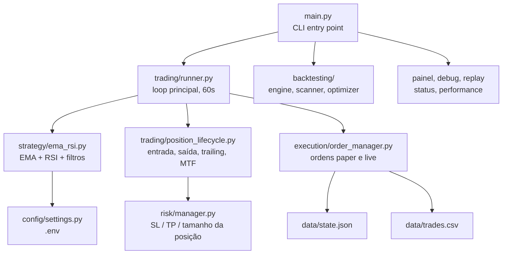

# Nautilus

Bot de trading algorítmico para criptomoedas, escrito em Python, operando na Binance via [ccxt](https://github.com/ccxt/ccxt). Monitora múltiplos pares simultaneamente, decide entradas e saídas com uma estratégia EMA + RSI configurável, e gerencia risco de ponta a ponta — stop loss e take profit dinâmicos via ATR, trailing stop, limites de drawdown por período e um circuit breaker por perdas consecutivas com autorrecuperação.

## Sobre o projeto

O bot opera só posições **long** (compra) em dois modos: `paper` (simulado, com os mesmos custos de execução — taxa e slippage — que existiriam num trade real) e `live` (dinheiro real, atrás de múltiplas confirmações explícitas). A regra de ouro do projeto é simples e não tem exceção: **nenhuma mudança de estratégia vai para live sem semanas de validação em paper mode rodando 24/7**, com amostra estatisticamente relevante de trades reais decorridos.

O desenvolvimento segue [spec-driven development](docs/13-metodologia-sdd.md) — toda mudança de escopo maior nasce de uma spec revisável em `specs/`, não de intuição solta, deixando rastro de *por que* cada decisão foi tomada.

## Funcionalidades

- Estratégia EMA crossover configurável (padrão 9/21/50) com filtro de tendência, RSI e entrada por pullback
- Filtros opcionais aditivos: regime de mercado via ADX, volatilidade elevada via ATR, Bollinger adaptativo
- Estratégia alternativa de rompimento (Donchian channel), comparável lado a lado via `compare`
- Stop Loss e Take Profit dinâmicos via ATR14 + Trailing Stop automático
- Circuit breaker por perdas consecutivas, com autodesativação por timeout (não trava para sempre)
- Kill switch manual, limites de drawdown diário/semanal/mensal, cooldown de reentrada por par
- Checagem de liquidez (spread + profundidade do order book) e ordens limit com preenchimento parcial
- Modo **paper** com custo de execução realista (taxa + slippage), paritário ao backtest
- Reconciliação automática de saldo em live — nunca corrige sozinho, sempre alerta
- Backtest completo (Sharpe, profit factor, win rate, drawdown), validação out-of-sample, walk-forward
- Observabilidade: painel operacional, diagnóstico por par, replay do caminho de decisão real sobre histórico
- Persistência completa em disco (trades, sinais, decisões, estado), recuperação automática após restart
- Alertas e relatório diário via Telegram (opcional)

## Arquitetura



Diagrama completo, com todos os módulos, em [docs/01 — Visão Geral](docs/01-visao-geral.md).

## Quickstart

```bash
git clone https://github.com/fisaarpelesjo/nautilus.git
cd nautilus
python -m venv .venv && .venv\Scripts\activate      # Windows (source .venv/bin/activate no Linux/Mac)
pip install -r requirements.txt
cp .env.example .env                                  # edite com suas chaves da Binance
python main.py status                                 # confere config + conexão
python main.py bot                                     # inicia em paper mode (padrão)
```

Guia completo, incluindo ambiente de desenvolvimento, em [docs/02 — Instalação](docs/02-instalacao.md).

> **Permissões na API key da Binance:** Leitura + Trading Spot apenas. **Nunca habilite saque.**

## Documentação completa

Toda a documentação detalhada vive em [`docs/`](docs/README.md), organizada por capítulo:

| # | Capítulo | Conteúdo |
|---|---|---|
| 01 | [Visão Geral](docs/01-visao-geral.md) | O que é o projeto, filosofia, arquitetura completa, estrutura de diretórios |
| 02 | [Instalação](docs/02-instalacao.md) | Setup do zero, primeira execução, ambiente de dev |
| 03 | [Estratégia](docs/03-estrategia.md) | Indicadores, regras de entrada/saída, filtros opcionais |
| 04 | [Gestão de Risco](docs/04-gestao-risco.md) | SL/TP via ATR, trailing stop, drawdown, position sizing |
| 05 | [Execução de Ordens](docs/05-execucao-ordens.md) | Paper vs live, custos simulados, ordens limit, liquidez |
| 06 | [Proteções Operacionais](docs/06-protecoes-operacionais.md) | Circuit breaker, kill switch, reconciliação |
| 07 | [Configuração](docs/07-configuracao.md) | Referência completa de todas as variáveis do `.env` |
| 08 | [Comandos CLI](docs/08-comandos-cli.md) | Todos os comandos `python main.py` |
| 09 | [Persistência de Dados](docs/09-persistencia-dados.md) | Arquivos gerados, formatos, o que cada um contém |
| 10 | [Observabilidade](docs/10-observabilidade.md) | Painel, debug, performance, replay |
| 11 | [Deploy em Produção](docs/11-deploy-producao.md) | Rodar 24/7 num servidor (guia genérico) |
| 12 | [Desenvolvimento](docs/12-desenvolvimento.md) | Fluxo de contribuição, testes, como adicionar uma estratégia |
| 13 | [Metodologia SDD](docs/13-metodologia-sdd.md) | Como o projeto decide o que construir |

## Aviso de risco

> Trading algorítmico envolve risco de perda de capital. Use `TRADING_MODE=paper` para validar a estratégia por semanas antes de operar com dinheiro real. Nunca invista mais do que pode perder. Resultados passados não garantem resultados futuros.
