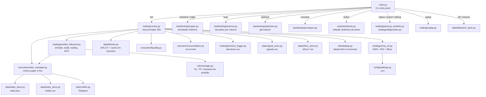

# 01 — Visão Geral

[← Sumário](README.md)

## O que é

**Nautilus** é um bot de trading algorítmico para criptomoedas, escrito em Python, operando na Binance via [ccxt](https://github.com/ccxt/ccxt). Ele monitora múltiplos pares simultaneamente, calcula indicadores técnicos a cada ciclo de 60 segundos, e decide entrar ou sair de posições **long** (o bot não opera short) com gestão de risco embutida — stop loss e take profit dinâmicos via ATR, trailing stop, limites de drawdown e um circuit breaker por perdas consecutivas.

O bot tem dois modos:

- **`paper`** (padrão) — simula ordens com saldo fictício, aplicando os mesmos custos de execução (taxa + slippage) que existiriam num trade real, para que o histórico gerado seja comparável ao que aconteceria em produção.
- **`live`** — opera com dinheiro real na Binance. Exige confirmação explícita (`LIVE_TRADING_CONFIRMATION`) e chaves de API com permissão de trading spot.

## Filosofia do projeto

1. **Paper mode primeiro, sempre.** Nenhuma mudança de estratégia vai para live sem semanas de validação em paper mode rodando 24/7. Ver [capítulo 13](13-metodologia-sdd.md) para como o projeto decide quando algo está "pronto".
2. **Falha conservadora (fail closed).** Sempre que o bot não consegue determinar um estado com confiança — order book indisponível, candle MTF não carregou, regime de mercado indefinido — a decisão padrão é **bloquear a entrada**, nunca aprovar por omissão de dado.
3. **Custo de execução realista desde o paper mode.** Taxa (`BACKTEST_FEE_RATE`) e slippage (`BACKTEST_SLIPPAGE_PCT`) são aplicados tanto no backtest quanto no paper mode — o histórico simulado não é sistematicamente mais otimista que a realidade.
4. **Proteções são cumulativas, não substitutas.** Circuit breaker, limites de drawdown diário/semanal/mensal e kill switch operam de forma independente uns dos outros — nenhum supre a ausência de outro.

## Arquitetura



## Estrutura de diretórios

```
├── main.py                    # CLI entry point — python main.py <comando>
├── bot.py                     # Wrapper de compatibilidade para trading/runner.py
├── config/
│   └── settings.py            # Todas as configs lidas do .env, com validate_config()
├── data/
│   ├── fetcher.py             # OHLCV + ticker via ccxt, cache em memória, retry de rate limit
│   ├── paths.py                # Caminhos dos arquivos locais
│   ├── atomic_io.py           # Escrita atômica (evita corrupção em crash no meio da gravação)
│   ├── csv_utils.py           # Helpers de leitura/escrita CSV
│   ├── trade_store.py         # Trades fechados → trades.csv
│   ├── signal_store.py        # Mudanças de sinal → signals.csv
│   ├── decision_store.py      # Decisões por ciclo/par → decisions.csv
│   ├── decisions_analysis.py  # Agregações sobre decisions.csv (usado por `decisions`)
│   ├── state_store.py         # Estado atual do bot → state.json
│   ├── killswitch_store.py    # Flag do kill switch → killswitch.json
│   ├── ohlcv_store.py         # Candles acumulados
│   └── ohlcv/                 # Candles históricos em CSV, por par/timeframe
├── strategy/
│   ├── base.py                # Interface BaseStrategy + dataclasses Signal/TradeSignal
│   ├── ema_rsi.py             # Estratégia principal: EMA + RSI + filtros opcionais
│   ├── breakout.py            # Estratégia alternativa: Donchian channel
│   └── diagnostics.py         # Checks e diagnóstico de sinais (usado por `debug`)
├── trading/
│   ├── runner.py              # Loop principal do bot
│   ├── decision_logger.py     # Histórico analítico de decisões
│   ├── position_lifecycle.py  # Entrada, saída, trailing stop, MTF
│   ├── portfolio.py           # Cálculo de patrimônio (caixa + posições)
│   ├── panel.py                # Agregação para o comando `painel`
│   └── replay.py              # Replay do caminho de decisão real sobre histórico
├── risk/
│   └── manager.py             # Calcula SL, TP, tamanho de posição
├── execution/
│   ├── order_manager.py       # Abre/fecha ordens; persiste state; circuit breaker
│   ├── liquidity.py           # Checagem de spread e profundidade do order book
│   └── reconciliation.py      # Compara state.json com saldo real (só em live)
├── market/
│   ├── selector.py            # Seleção dinâmica de pares por liquidez/spread/volatilidade
│   └── commands.py            # Comando `select`
├── backtesting/
│   ├── engine.py               # Motor de backtest histórico
│   ├── multi.py                # Backtest em lista fixa de pares
│   ├── scanner.py              # Top N pares por volume na Binance
│   ├── optimizer.py            # Grid search de parâmetros
│   ├── compare.py              # Compara estratégias/presets lado a lado
│   ├── validation.py           # Split treino/validação out-of-sample
│   ├── approval.py             # Veredito de aprovação (edge vs buy-and-hold)
│   ├── robustness.py           # Walk-forward e testes de robustez
│   ├── analysis.py             # Análise de trades.csv
│   └── performance_charts.py  # Curva de capital, drawdown, PnL por par
├── utils/
│   ├── chart.py                # Gráfico interativo Dash/Plotly
│   ├── display.py              # Rich: tabela multi-par, formatação de preços
│   ├── logger.py               # Logger colorido no terminal + arquivo em logs/
│   ├── notifier.py             # Alertas via Telegram
│   └── report_export.py       # Exporta relatórios de backtest/scan/optimize para reports/
├── tests/                      # Suíte pytest
├── docs/                       # Esta documentação
└── specs/                      # Histórico de spec-driven development (ver cap. 13)
```

## Próximos passos

- Nunca rodou o bot? Vá para [02 — Instalação](02-instalacao.md).
- Quer entender as regras de entrada/saída? Vá para [03 — Estratégia](03-estrategia.md).
- Quer só a referência de configuração? Vá direto para [07 — Configuração](07-configuracao.md).
