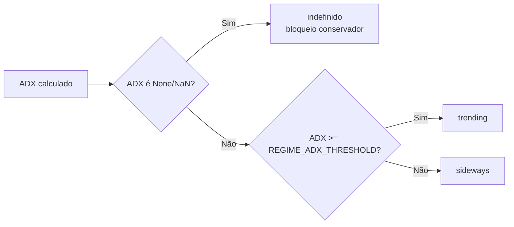
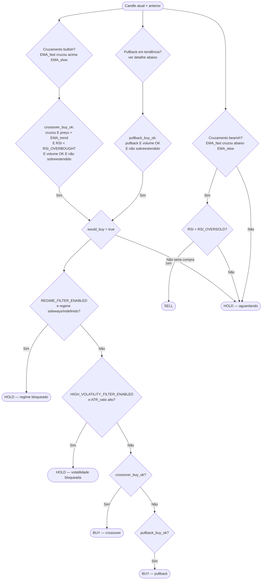

# 03 — Estratégia

[← Sumário](README.md)

O bot roda uma estratégia por vez, trocável via `strategy=` no construtor usado em `trading/runner.py` e `backtesting/engine.py`. A estratégia padrão em produção é `EmaRsiStrategy`.

## EmaRsiStrategy (`strategy/ema_rsi.py`)

### Indicadores calculados (`calculate_indicators`)

| Indicador | Config | Default | Uso |
|---|---|---|---|
| EMA rápida | `EMA_FAST` | `9` | Cruzamento e pullback |
| EMA lenta | `EMA_SLOW` | `21` | Cruzamento e pullback |
| EMA tendência | `EMA_TREND` | `50` | Filtro de tendência |
| RSI | `RSI_PERIOD` | `14` | Filtro de sobrecompra/sobrevenda |
| ATR | fixo, janela 14 | `14` | SL/TP dinâmico (ver [cap. 04](04-gestao-risco.md)) |
| ATR ratio | `atr / close` | — | Indicador de volatilidade relativa |
| ADX | fixo, janela 14 | `14` | Base do regime de mercado |
| MACD diff | padrão da lib `ta` | — | Calculado e logado, **não usado no sinal** |
| Volume MA | `VOLUME_MA_PERIOD` | `20` | Filtro de volume mínimo |
| Bollinger Bands | `BB_PERIOD` / `BB_STD` | `20` / `2.0` | Filtro de sobreextensão |

`atr_ratio` trata `close == 0` (candle inválido/par congelado) como `NaN` explicitamente — sem isso viraria `+inf` e escaparia do `dropna()`, furando o caminho de "dado desconhecido" que o filtro de volatilidade espera.

### Regime de mercado

`REGIME_ADX_THRESHOLD` (default `20`) é o corte. Dado insuficiente nunca vira "trending" por omissão — sempre "indefinido", que o filtro de regime (quando ligado) trata como bloqueio.

### Fluxo de decisão de sinal (`generate_signal`)

**Ponto de design importante:** os filtros de regime e volatilidade elevada só entram no caminho **se `would_buy` já for verdadeiro** — ou seja, eles bloqueiam apenas novas entradas. Um sinal SELL de uma posição já aberta nunca passa por esse bloqueio, porque `would_buy` é calculado só a partir das condições de compra.

### Entrada por cruzamento (`crossover_buy_ok`)

Todas as condições abaixo, simultaneamente:

1. EMA rápida cruza **acima** da EMA lenta neste candle (não estava acima no candle anterior)
2. Preço > EMA de tendência
3. RSI < `RSI_OVERBOUGHT` (default `70`)
4. Volume ≥ `volume_ma × VOLUME_MIN_RATIO` (default ratio `1.0`, ou seja, volume ≥ média)
5. Preço ≤ banda superior de Bollinger — **ou** `ADAPTIVE_BOLLINGER_ENABLED=true` com tendência e volume já fortes (mesmos critérios 2 e 4 reaproveitados, não é um terceiro conjunto de regras)

### Entrada por pullback (`_is_pullback_entry`, ativa se `PULLBACK_ENTRY_ENABLED=true`, default ligado)

Todas as condições abaixo:

1. `EMA_fast > EMA_slow > EMA_trend` **e** preço > EMA de tendência (tendência de alta bem estabelecida)
2. `PULLBACK_RSI_MIN` (default `45`) ≤ RSI < `RSI_OVERBOUGHT`
3. Mínima do candle está a até `PULLBACK_MAX_DISTANCE_PCT` (default `1%`) acima da EMA lenta — ou seja, o preço "tocou" a EMA lenta recentemente
4. Preço de fechamento > EMA rápida (já recuperou)
5. Candle é de alta (`close > open`)

Depois de passar essas 5 condições, o pullback ainda precisa satisfazer volume OK e "não sobreestendido" (mesmos critérios 4 e 5 do crossover) para virar `BUY`.

### Saída (SELL)

EMA rápida cruza **abaixo** da EMA lenta **e** RSI > `RSI_OVERSOLD` (default `35`). O sinal SELL, por si só, não fecha a posição — quem decide o fechamento é `trading/position_lifecycle.py` (ver [cap. 04](04-gestao-risco.md)).

## BreakoutStrategy (`strategy/breakout.py`)

Estratégia alternativa, não usada em produção por padrão — disponível para comparação via `python main.py compare`. Donchian channel puro:

- **BUY**: preço fecha acima da máxima das últimas `BREAKOUT_WINDOW` velas (default `150`, testável em 50/150/200)
- **SELL**: preço fecha abaixo da mínima das últimas `BREAKOUT_WINDOW` velas
- A janela de máxima/mínima é deslocada um candle para trás (`shift(1)`) — evita comparar o candle atual contra uma faixa que já inclui ele mesmo (look-ahead bias)

## Adicionando uma estratégia nova

Ver [12 — Desenvolvimento](12-desenvolvimento.md#adicionar-uma-estrategia-nova).

## Próximo capítulo

Sinal `BUY` gerado é só o começo — [04 — Gestão de Risco](04-gestao-risco.md) cobre como o tamanho da posição, stop loss e take profit são calculados a partir daí.
