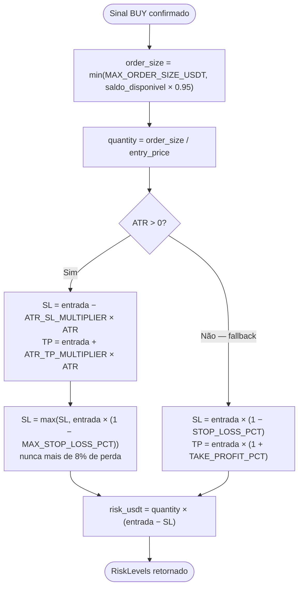
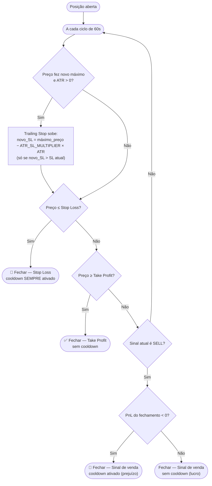
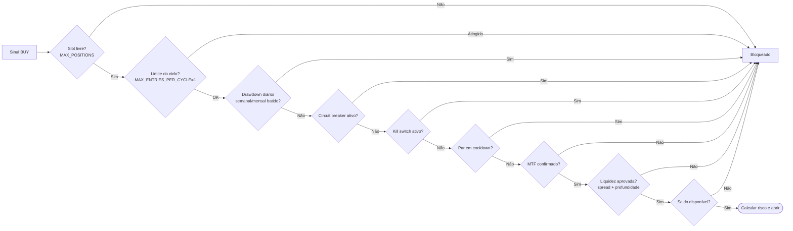

# 04 — Gestão de Risco

[← Sumário](README.md)

Gestão de risco é dividida em duas responsabilidades separadas: `risk/manager.py` calcula **quanto** arriscar e onde ficam SL/TP no momento da entrada; `trading/position_lifecycle.py` decide **quando** sair, ciclo a ciclo, enquanto a posição está aberta.

## Cálculo de risco na entrada (`risk/manager.py`)

| Parâmetro | Fórmula | Default |
|---|---|---|
| Tamanho da ordem | `min(MAX_ORDER_SIZE_USDT, saldo_disponível × 0.95)` | teto `$100` |
| Stop Loss (ATR disponível) | `entrada − ATR_SL_MULTIPLIER × ATR14` | `1.5×` ATR |
| Take Profit (ATR disponível) | `entrada + ATR_TP_MULTIPLIER × ATR14` | `3.0×` ATR |
| Stop Loss (fallback, ATR=0) | `entrada × (1 − STOP_LOSS_PCT)` | `−1.5%` |
| Take Profit (fallback, ATR=0) | `entrada × (1 + TAKE_PROFIT_PCT)` | `+6.0%` |
| SL mínimo absoluto (teto de perda) | nunca abaixo de `entrada × (1 − MAX_STOP_LOSS_PCT)` | `8%` |
| Risk/reward (com ATR) | `1.5×` risco / `3.0×` alvo → **1:2** | — |

`MAX_STOP_LOSS_PCT` existe porque `ATR_SL_MULTIPLIER` puro não tem limite prático em pares de alta volatilidade — um caso real em paper mode (ACE/USDT) teve o SL inicial calculado ~20% abaixo da entrada, porque o ATR em % do preço daquele altcoin é grande. O teto trava o pior caso sem alterar o comportamento em pares de volatilidade normal, onde o SL via ATR já fica bem dentro de 8%.

O `saldo_disponível` usado no dimensionamento não é o saldo total — é `saldo_atual / slots_livres_restantes` (calculado em `handle_entry_candidate`, `trading/position_lifecycle.py`), reservando espaço proporcional para as demais posições que ainda podem abrir no mesmo ciclo.

## Ciclo de vida da posição aberta (`position_lifecycle.py`)

Pontos que não são óbvios só de olhar o fluxo:

- O **PnL usado para decidir cooldown** vem do retorno real de `close_position()` — não de um pré-cálculo a partir do preço de mercado bruto. Em paper mode o preço de preenchimento já inclui slippage/fee, então um pré-cálculo ficaria dessincronizado do PnL real gravado em `data/trades.csv` (achado de code-review corrigido na spec 010).
- O trailing stop só sobe — nunca desce, mesmo que o preço recue sem bater o SL atual.
- Take Profit nunca ativa cooldown (saída planejada); Stop Loss sempre ativa; venda por sinal só ativa se o resultado foi negativo.

## Bloqueadores de entrada

Antes de calcular risco para uma nova posição, `handle_entry_candidate` checa, nesta ordem (a primeira barata elimina antes de gastar chamada de rede nas mais caras):

`MTF_TIMEFRAME` (default `1d`) confirma que o preço também está acima da EMA de tendência no timeframe maior antes de liberar a entrada — ver `mtf_confirmed()`. **Limitação conhecida:** se a busca do candle MTF falhar (erro de rede), `mtf_confirmed()` retorna `True` (falha aberta), inconsistente com o resto do arquivo, que sempre falha fechado em caso de dado desconhecido (saldo indisponível, liquidez indisponível). Está catalogado como gap pendente — ver `specs/BACKLOG.md`.

## Limites de drawdown (diário / semanal / mensal)

Mesmo padrão para os três períodos — `is_daily_limit_hit()` / `is_weekly_limit_hit()` / `is_monthly_limit_hit()`:

| Limite | Config | Default | Reset |
|---|---|---|---|
| Diário | `DAILY_DRAWDOWN_LIMIT` | `5%` | virada do dia calendário |
| Semanal | `WEEKLY_DRAWDOWN_LIMIT` | `10%` (≥ diário, validado) | virada da semana ISO |
| Mensal | `MONTHLY_DRAWDOWN_LIMIT` | `20%` (≥ semanal, validado) | virada do mês calendário |

Cada período tem seu próprio **saldo de referência**, capturado no momento do reset (`_reference_balance()`). Se o saldo de referência não puder ser determinado (erro ao buscar saldo real em live), o limite bloqueia de forma conservadora em vez de comparar contra `$0`.

## Cooldown de reentrada por par

`COOLDOWN_HOURS` (default `4`) bloqueia reentrada no **mesmo par** depois de um fechamento com cooldown ativado (Stop Loss sempre; venda por sinal só se PnL negativo). `is_in_cooldown()` compara `datetime.now() - cooldown_timestamp < COOLDOWN_HOURS` — não é persistente entre reinícios do processo além do que `state.json` já guarda.

## Próximo capítulo

Com SL/TP calculados e a posição pronta para abrir, [05 — Execução de Ordens](05-execucao-ordens.md) cobre como a ordem realmente é enviada (paper vs live, ordens limit, checagem de liquidez).
