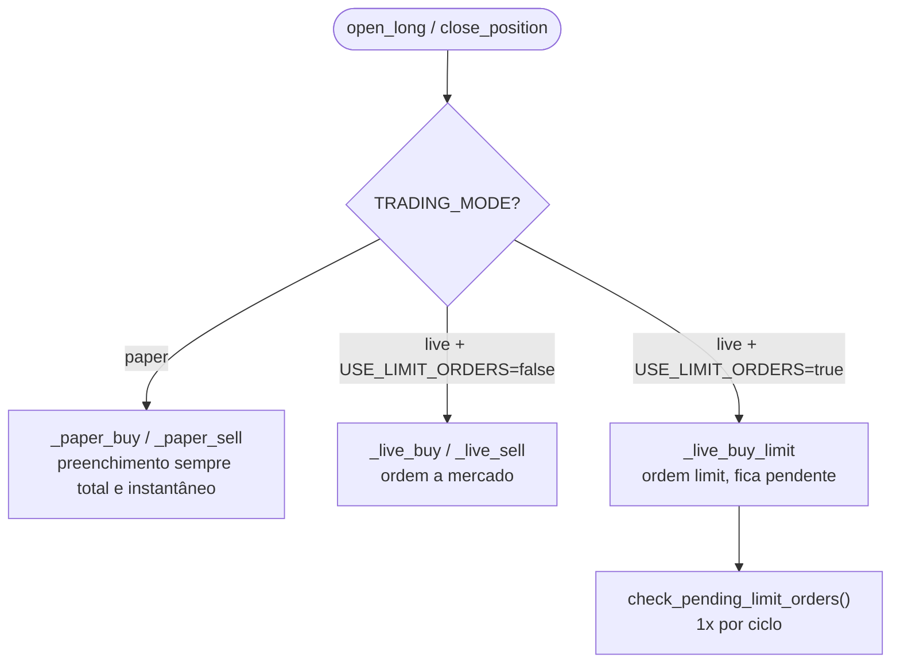
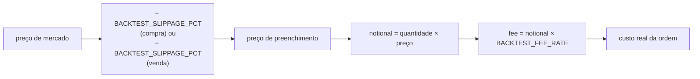
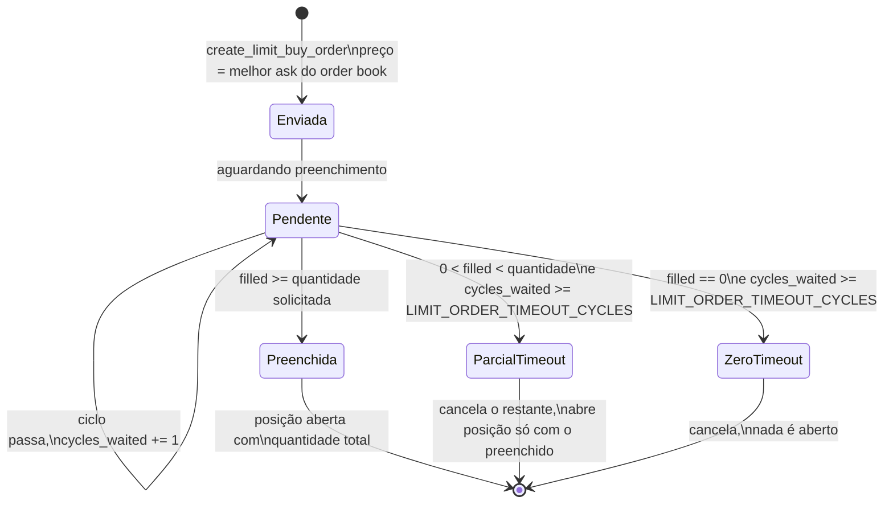

# 05 — Execução de Ordens

[← Sumário](README.md)

`execution/order_manager.py` é responsável por transformar uma decisão de "abrir/fechar posição" numa ordem de verdade — simulada em paper mode, real em live — e por manter `data/state.json` consistente em todo momento.

## Paper vs Live

### Custo de execução simulado em paper mode

Desde a spec 010, `_paper_buy`/`_paper_sell` aplicam **a mesma fórmula** de `backtesting/engine.py`:

Por que isso importa: sem essa paridade, o histórico de `data/trades.csv` em paper mode ficaria sistematicamente mais otimista que o que aconteceria de verdade — o mesmo viés que motivou a correção da spec 010 (ver [13 — Metodologia SDD](13-metodologia-sdd.md)).

Um detalhe não óbvio: a taxa de saída usa `pos.entry_fee` — a taxa **realmente paga na compra**, persistida na posição — em vez de recalcular com o `BACKTEST_FEE_RATE` atual do `.env`. Isso evita que editar essa variável e reiniciar o bot com uma posição já aberta corrompa retroativamente o PnL dela.

`TRADING_MODE=live` não é afetado por nenhuma dessas simulações — a execução real já paga custo real de mercado.

## Idempotência em live

Toda ordem live carrega um `client_order_id` único, gerado uma vez e **reaproveitado em retries**:

- Compra: `pending_open_client_order_ids[symbol]` guarda o ID antes de tentar a chamada. Se a chamada falhar (timeout, erro de rede) mas a ordem tiver sido aceita pela Binance mesmo assim, o próximo ciclo tenta de novo **com o mesmo ID** — a exchange reconhece como a mesma ordem em vez de abrir uma segunda posição.
- Venda: mesmo padrão via `pos.pending_close_client_order_id`.
- Em nenhum dos dois casos a posição local é apagada/criada só por causa de uma exceção na chamada — só a confirmação da exchange (ou a reconciliação periódica, ver [06](06-protecoes-operacionais.md)) altera o estado local.

## Ordens limit com preenchimento parcial

Desligado por padrão (`USE_LIMIT_ORDERS=false`, preserva o comportamento a mercado já validado). Quando ligado:

`check_pending_limit_orders()` é chamado uma vez por ciclo pelo `trading/runner.py`, nunca dentro do próprio cálculo de entrada — o preço limite usado é o melhor ask do order book, já obtido pela checagem de liquidez (não gasta uma segunda chamada de rede só para isso).

## Checagem de liquidez (`execution/liquidity.py`)

Antes de qualquer entrada, `check_liquidity()` consulta o order book real:

| Condição | Bloqueia se |
|---|---|
| Spread | `(melhor_ask − melhor_bid) / melhor_bid > MAX_SPREAD_PCT_ENTRY` |
| Profundidade do lado ask | soma de `preço × quantidade` de todos os asks `< max(MIN_ORDERBOOK_DEPTH_USDT, 3 × tamanho_da_ordem)` |
| Falha ao buscar o order book | sempre bloqueia — `"liquidez indisponivel"`, nunca aprovação por omissão |

`MIN_ORDERBOOK_DEPTH_USDT` default é `3 × MAX_ORDER_SIZE_USDT` — ou seja, o book precisa ter profundidade pra absorver a ordem sem mover o preço de forma desproporcional.

> **Limitação conhecida:** a profundidade soma **todos os 20 níveis** do order book retornado pela API, não só os níveis próximos ao preço atual — um nível de profundidade muito longe do preço de mercado conta igual a um nível colado no book. Catalogado em `specs/BACKLOG.md` como candidato de melhoria.

## Reaproveitando o exchange (rate limit)

`data/fetcher.py::get_exchange()` mantém um **singleton por modo** (sandbox/produção) em vez de criar uma instância `ccxt.binance` nova a cada chamada — uma instância nova a cada vez zerava o rate limiter interno do `ccxt`. Chamadas de `fetch_ohlcv`/`fetch_ticker`/`fetch_tickers`/`fetch_balance`/`fetch_order_book` têm retry automático com backoff (3 tentativas) especificamente para `ccxt.RateLimitExceeded`/`ccxt.DDoSProtection` (HTTP 429/418).

## Próximo capítulo

[06 — Proteções Operacionais](06-protecoes-operacionais.md) cobre as camadas que existem *acima* de uma ordem individual: circuit breaker, kill switch e reconciliação de saldo.
