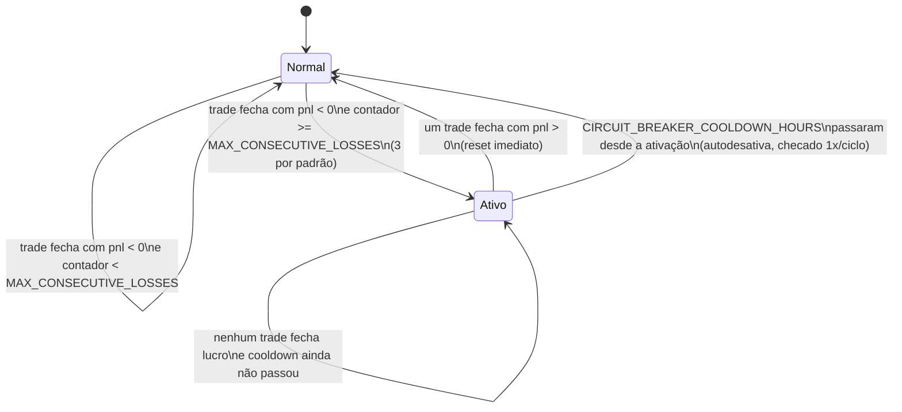
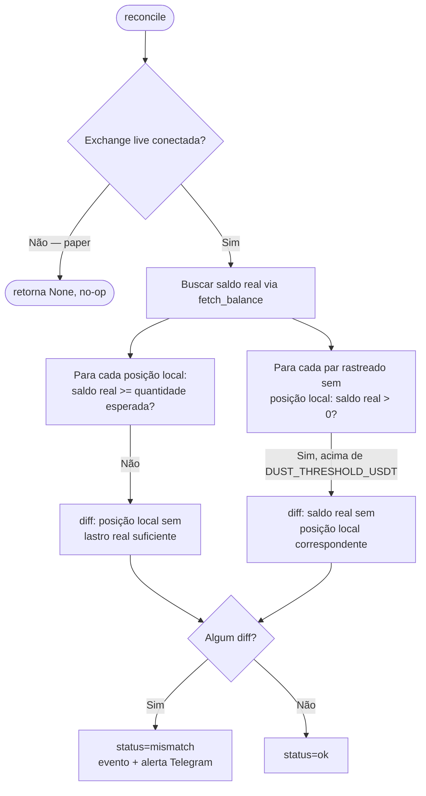

# 06 — Proteções Operacionais

[← Sumário](README.md)

Quatro camadas de proteção, independentes e cumulativas entre si — nenhuma substitui outra. Os limites de drawdown já foram cobertos em [04](04-gestao-risco.md#limites-de-drawdown-diario--semanal--mensal); este capítulo cobre as demais.

## Circuit breaker

Contador global (não por par) de perdas consecutivas — perdas em pares diferentes acumulam no mesmo contador, tratando o capital como recurso compartilhado.



Enquanto **ativo**: novas entradas em qualquer par são bloqueadas; posições já abertas continuam sendo geridas normalmente (SL/TP/trailing não param).

O reset por timeout existe porque, sem ele, um breaker que ativa **sem nenhuma posição aberta** travaria o bot para sempre — não sobraria nenhum trade em andamento capaz de gerar o lucro que zera o contador. `check_circuit_breaker_timeout()` roda uma vez por ciclo (só quando o breaker está ativo) e, ao expirar o cooldown, zera `consecutive_losses`, desativa o breaker, loga o evento `circuit_breaker_timeout_reset` e alerta via Telegram — sem precisar de nenhuma ação manual.

| Config | Default | Efeito |
|---|---|---|
| `MAX_CONSECUTIVE_LOSSES` | `3` | perdas seguidas até ativar |
| `CIRCUIT_BREAKER_COOLDOWN_HOURS` | `4` | horas até autodesativar mesmo sem lucro |

Visível em `python main.py status`. Não existe comando para resetar manualmente antes do timeout — é intencional, mas significa que, se `CIRCUIT_BREAKER_COOLDOWN_HOURS` for aumentado muito, a única saída antes do prazo é editar `data/state.json` diretamente.

## Kill switch

Flag manual, independente de tudo o resto — `data/killswitch.json`, **não** dentro de `state.json`, de propósito: assim uma escrita normal do bot em execução nunca sobrescreve uma ativação externa.

```bash
python main.py kill      # ativa — bloqueia novas entradas
python main.py resume    # desativa — libera novas entradas
```

O bot lê o arquivo do disco uma vez por ciclo. Posições já abertas continuam geridas normalmente (mesmo comportamento do circuit breaker nesse aspecto). Kill switch e circuit breaker são mecanismos **completamente separados** — `resume` nunca desativa o circuit breaker, e o circuit breaker nunca liga/desliga o kill switch.

## Reconciliação (`execution/reconciliation.py`)

Só roda em `TRADING_MODE=live` (`manager.exchange is not None`) — no-op em paper, onde não existe conta real para comparar. Executa na inicialização e a cada `RECONCILIATION_INTERVAL_CYCLES=30` ciclos (~30min).



Checa os **dois sentidos**: posição local que não tem lastro real suficiente (venda que "falhou silenciosamente", ou `state.json` desatualizado) e saldo real de um par rastreado sem posição local correspondente (posição perdida por crash antes de persistir, ou edição manual do `state.json`). Um saldo residual (`dust`) abaixo de `DUST_THRESHOLD_USDT` (`$1`) não dispara alerta — mas se o preço do ativo não puder ser obtido para essa checagem, o valor vira "infinito" em vez de `$0`, para nunca silenciar uma divergência real só porque o preço falhou.

**Nunca corrige automaticamente** — só loga o evento `reconciliation_mismatch`/`reconciliation_error` e alerta. A correção é decisão do operador. Resultado visível em `python main.py status`.

## Confirmação de sessão live

Antes do loop principal, em `TRADING_MODE=live`, `trading/runner.py` exibe um resumo (pares, saldo real, `MAX_ORDER_SIZE_USDT`, `MAX_POSITIONS`, todos os limites de drawdown/perdas-consecutivas) e grava o evento `live_session_started`. Não bloqueia a inicialização esperando confirmação interativa — é só informativo, **além** do `LIVE_TRADING_CONFIRMATION` que já é obrigatório em `config/settings.py` (sem ele, `validate_config()` recusa subir em modo live). Não aparece em paper.

## Resumo — quem bloqueia o quê

| Proteção | Bloqueia novas entradas | Bloqueia saídas | Autorrecuperável |
|---|---|---|---|
| Circuit breaker | ✅ | ❌ | ✅ (lucro ou `CIRCUIT_BREAKER_COOLDOWN_HOURS`) |
| Kill switch | ✅ | ❌ | ❌ (só `python main.py resume`) |
| Drawdown diário/semanal/mensal | ✅ | ❌ | ✅ (virada do período) |
| Cooldown por par | ✅ (só aquele par) | ❌ | ✅ (`COOLDOWN_HOURS`) |
| Reconciliação (live) | ❌ (só alerta) | ❌ | — |

## Próximo capítulo

[07 — Configuração](07-configuracao.md) traz a referência completa de todas as variáveis usadas neste e nos capítulos anteriores.
