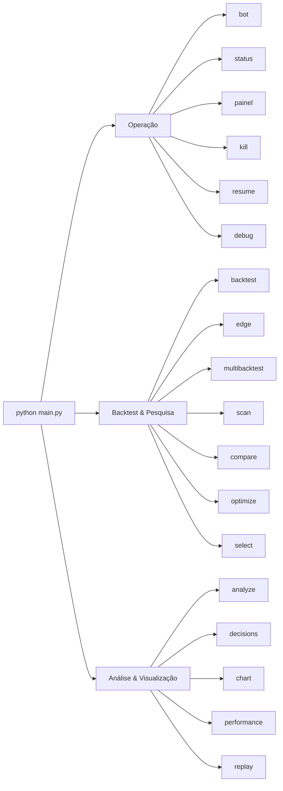

# 08 — Comandos CLI

[← Sumário](README.md)

Todo comando é `python main.py <comando>`. Sem argumento, o padrão é `bot`. Comandos têm aliases em português onde faz sentido (`analyze`/`analisar`, `decisions`/`decisoes`, `optimize`/`otimizar`, `select`/`selecionar`, `compare`/`comparar`, `performance`/`desempenho`).



## Operação

| Comando | Descrição |
|---|---|
| `python main.py bot` | Inicia o loop principal, multi-par, poll a cada 60s |
| `python main.py status` | Patrimônio (caixa/posições/total), PnL, circuit breaker e kill switch |
| `python main.py painel` | Patrimônio, posições abertas, últimas operações/sinais e bloqueios recentes numa única tela |
| `python main.py kill` | Ativa o kill switch — suspende novas entradas |
| `python main.py resume` | Desativa o kill switch — retoma novas entradas |
| `python main.py debug [PAR]` | Explica cada condição de entrada (EMA, RSI, MTF, regime, volatilidade, cooldown) pra um par específico |

## Backtest & pesquisa

| Comando | Descrição |
|---|---|
| `python main.py backtest` | Backtest no par principal (`PAIRS[0]`) |
| `python main.py backtest --validate` | Backtest com split treino/validação out-of-sample + veredito |
| `python main.py edge` | Relatório de vantagem estatística contra buy-and-hold |
| `python main.py edge --validate` | Mesmo relatório, mas sobre a fatia de validação out-of-sample (treino e validação lado a lado) |
| `python main.py multibacktest` | Backtest numa lista fixa de pares |
| `python main.py scan` | Backtest nos top 30 pares por volume na Binance |
| `python main.py compare` | Compara múltiplas estratégias/presets lado a lado, mesmos pares/timeframe |
| `python main.py multimarket [SÍMBOLOS...]` | Varre estratégia × símbolo em vários mercados, **exigindo confirmação fora da janela de busca** — ver abaixo |
| `python main.py horizonte [TF...]` | Avalia as estratégias em 4h/1d/1w com a bateria completa — ver abaixo |
| `python main.py volatilidade [ALVO]` | Compara cada estratégia com e sem dimensionamento por volatilidade — ver abaixo |
| `python main.py barras [TIPO]` | Compara amostragem por tempo contra amostragem por informação — ver abaixo |
| `python main.py optimize` | Grid search dos melhores parâmetros |
| `python main.py optimize --walk-forward` | Grid search com validação walk-forward |
| `python main.py select` | Ranqueia candidatos de pares dinâmicos por liquidez, spread e volatilidade |

## Análise & visualização

| Comando | Descrição |
|---|---|
| `python main.py analyze` | Resumo de `data/trades.csv`: win rate, profit factor, expectância, PnL por par e por motivo de saída |
| `python main.py decisions` | Resume `data/decisions.csv`: sinais, bloqueios e indicadores médios (ex: RSI) por sinal |
| `python main.py chart [PAR] [TF]` | Gráfico interativo no navegador (Dash/Plotly): candlestick, EMAs, RSI, marcadores de sinal e de trades reais |
| `python main.py performance` | Curva de capital, drawdown e PnL por par a partir de `data/trades.csv`, HTML no navegador |
| `python main.py replay [PAR]` | Roda o caminho de decisão **real** de produção sobre histórico, isolado — nunca toca os arquivos reais (ver [10 — Observabilidade](10-observabilidade.md)) |

## `multimarket` — varredura com confirmação fora da amostra

```bash
python main.py multimarket AAPL EURUSD=X ES=F BTC/USDT
python main.py multimarket              # usa RESEARCH_SYMBOLS do .env
```

Aceita símbolos de qualquer mercado — o mercado é deduzido do formato (`AAPL` → ações EUA, `PETR4.SA` → ações BR, `EURUSD=X` → forex, `ES=F` → futuros, `^GSPC` → índice, `BTC/USDT` → cripto).

**Por que existe separado do `compare`**: a pergunta é outra. O `compare` mostra como cada combinação se saiu; o `multimarket` responde se alguma **se sustenta fora da janela onde foi descoberta**.

Isso importa porque testar N estratégias × M símbolos produz aprovações por acaso. Com o profit factor mediano observado neste projeto (0,60), é matematicamente esperado que algumas passem por sorte. Sem dividir as janelas, sorte vira "achado".

| Status | Significado |
|---|---|
| `confirmado` | Passou também na janela de confirmação — a única leitura que conta como aprovação |
| `so na busca` | Passou onde foi descoberto e **não** se sustentou fora. **Não é aprovação** |
| `reprovado` | Não passou em nenhuma das duas |
| `inconclusivo` | Histórico insuficiente para dividir as janelas — nunca aprovado por omissão |

A tabela é ordenada por **status antes de retorno**: um resultado confirmado modesto vale mais que um espetacular não confirmado. Ordenar por retorno colocaria o segundo no topo, que é precisamente a leitura errada.

O cabeçalho mostra quantas combinações foram avaliadas — uma aprovação entre 200 tentativas tem peso estatístico diferente de uma entre 3.

Símbolos de mercado com pregão descontínuo levam `*`: o teto de perda por trade não age dentro de um gap de abertura.

## Saída de cada comando

A maioria dos comandos de backtest/scan/optimize também grava um relatório auditável em `reports/{comando}_{timestamp}.{json,csv,md}` — ver [09 — Persistência de Dados](09-persistencia-dados.md).

## Próximo capítulo

[09 — Persistência de Dados](09-persistencia-dados.md) detalha exatamente o que cada comando lê e escreve em disco.

---

## Horizonte temporal (pesquisa — spec 024)

`python main.py horizonte [TF...]` avalia as estratégias já implementadas em
múltiplas escalas temporais, submetendo cada combinação à mesma régua usada
pelas demais hipóteses. Sem argumento, avalia `4h 1d 1w`.

**Por que existe.** Liu & Tsyvinski (2021) documentam momentum de série temporal
em criptoativos em horizontes de **uma a quatro semanas**; o bot opera em 4h. Se
o efeito existe nessa escala e não na atual, as hipóteses direcionais já
reprovadas mediram a escala, não a estratégia.

**Não altera o `TIMEFRAME` de produção.** O comando lê a configuração apenas
para exibir a linha de base. Mudar o horizonte operacional por resultado de
backtest é o que a metodologia existe para impedir.

**Universo e estratégias não são parametrizáveis por CLI**, de propósito: expor
os dois como flag convidaria a varrer combinações até achar uma que passe.

### Limitação estrutural do horizonte semanal

Medido em 2026-09-01: em escala semanal a Binance entrega de 311 a 473 candles
por par. Descontado o aquecimento de 50 candles (**350 dias**, quase um ano), o
split 70/30 produz janela de validação de 78 a 127 — abaixo do mínimo de 150 de
`MIN_WINDOW_CANDLES`. **Nenhum par comporta a confirmação fora da amostra em
1w**, e o resultado correto é `inconclusivo`, não `reprovado`.

A execução real confirmou: 115 combinações em 1w, **0 confirmadas, 115
inconclusivas**.

### Ordem de exibição

Contexto de dado → contagem → tabela → comparativo → legenda. A contagem vem
**antes** da tabela porque uma confirmação entre 345 tentativas tem peso
estatístico distinto de uma entre 3.

### Estados

| Estado | Significado |
|---|---|
| `confirmado` | Aprovado na busca **e** na confirmação |
| `so na busca` | Aprovado onde foi descoberto, não sustentado fora. **Não é aprovação** |
| `reprovado` | Falha em critério com amostra suficiente |
| `inconclusivo` | Amostra insuficiente para julgar — **não** é ausência de vantagem |
| `erro` | Falha ao obter dados |

`inconclusivo` **precede** `reprovado`: combinação com menos operações que
`EDGE_MIN_TRADES`, sem janela de confirmação válida, ou com menos de 3 janelas de
walk-forward é inconclusiva mesmo que as métricas pareçam ruins. Foi essa
distinção que separou H10 de uma reprovação indevida.

---

## Dimensionamento por volatilidade (pesquisa — spec 025)

`python main.py volatilidade [ALVO]` (alias `voltarget`) roda cada estratégia
**duas vezes sobre a mesma série** — uma com o dimensionamento vigente, outra
escalando a posição pela volatilidade realizada — e compara as duas.

```
fator = min(1,0; ALVO / atr_ratio)
tamanho = tamanho_original × fator
```

**O teto de 1,0 é a fórmula, não validação defensiva.** O fator vive em
`(fator_mínimo, 1,0]`, então o dimensionamento só pode **reduzir** a posição.
Não existe caminho pelo qual este comando produza alavancagem — nem por alvo mal
configurado, nem por volatilidade anormalmente baixa.

**Por que existe.** H7 (momentum transversal) foi a única hipótese do registro a
reprovar **exclusivamente** no limite de risco: drawdown de 11,76% contra o teto
de 10,0%, com todos os demais critérios passando. Se o excesso fosse
consequência do dimensionamento, H7 voltaria para dentro do teto.

**Não altera o caminho de produção.** `risk/manager.py` continua dimensionando
como hoje. O mecanismo vive atrás de um parâmetro opcional de
`simulate_backtest` cujo default reproduz o comportamento atual campo a campo —
há teste de regressão para isso.

**O alvo aceita argumento, mas não é para varrer.** O padrão é `0,02`, próximo à
mediana medida de `atr_ratio` (0,0187 em 23.412 observações de 4h). O argumento
existe para inspeção manual e reprodutibilidade; executar com alvos diferentes
até um passar é o problema de testes múltiplos que a metodologia contém.

### `sem vantagem` — o estado que define este comando

| Estado | Significado |
|---|---|
| `melhora` | Base lucrativa, ganho por capital exposto subiu **e** se confirmou fora da amostra |
| `só na busca` | Melhorou onde foi medido e não se sustentou na validação. **Não é aprovação** |
| `confundido` | A base **perde dinheiro**: encolher a posição aproxima de zero e isso não é vantagem |
| `sem vantagem` | O ganho desapareceu ao descontar exposição de capital |
| `piora` | Drawdown subiu |
| `inconclusivo` | Amostra insuficiente, ou sem janela de validação — **não** é ausência de vantagem |
| `inerte` | O fator ficou em 1,0: as duas versões são a mesma execução, nada foi medido |
| `erro` | Falha ao obter dados ou simular |

**`inerte` não é `piora`.** Das quatro estratégias do universo, só
`EmaRsiStrategy` calcula `atr_ratio`; nas demais o fator fica preso em 1,0 e
não há comparação a julgar. Na avaliação de H12 isso foi **37 das 48**
combinações — limitação do instrumento, não evidência.

**`confundido` é a guarda contra M11.** Reduzir posição encolhe a magnitude do
resultado *nos dois sentidos*. Sobre uma estratégia de expectativa negativa
isso aproxima o resultado de zero e a métrica registra ganho; o limite da
lógica é `fator_minimo → 0`, isto é, não operar maximizaria o critério sem
ganhar nada. Medido em H12: correlação de **−0,92** entre retorno base e ganho
de timing, concordância de sinal em 8 de 8.

Dimensionar por volatilidade **reduz exposição por construção** — fator médio
0,90 na medição, ou seja ~10% menos participação. Num mercado em queda isso
sozinho melhora o retorno relativo ao buy-and-hold sem qualquer capacidade de
seleção. É o achado M7.

Por isso a decisão usa `dTiming` e **não** `dRet`. Mas o desconto correto aqui
não é o de tempo: `_exposure_pct` mede segundos em posição, e dimensionar muda
*quanto* capital entra, nunca *quando*. A exposição de tempo é idêntica entre as
duas versões — a coluna `dExpoTempo` existe para exibir esse zero, porque um
zero mostrado é evidência e um zero omitido é só ausência.

`dTiming` é o ganho **por unidade de capital exposto**. A razão importa: se o
dimensionamento apenas escala tudo por um fator `f`, ganho e exposição escalam
juntos e a razão fica invariante — delta exatamente zero, status `sem vantagem`.
Ela só se move quando a redução é **seletiva**, que é a única coisa que a
hipótese afirma.

A ordem das checagens é a regra: amostra insuficiente em **qualquer** das duas
versões produz `inconclusivo` antes de qualquer avaliação de métrica — comparar
30 operações contra 4 mede diferença de amostra, não dimensionamento.

### Confirmação fora da amostra

`melhora` exige que o ganho se sustente numa fatia que não participou da
descoberta, via o mesmo `split_train_validation` das demais hipóteses. Sem isso
`melhora` significaria apenas "melhorou onde foi medido" — a forma de aprovação
que este projeto recusa desde H10.

### Custo de giro

Ajustar o tamanho implica giro, e giro paga taxa. A coluna `dCusto` e o agregado
ao fim separam "o mecanismo não ajuda" de "o mecanismo ajuda e o custo come o
ganho" — conclusões diferentes. Custo não medido aparece como `-`, nunca como
`0,00`.

---

## Barras dirigidas por informação (pesquisa — spec 026)

`python main.py barras [dollar|cusum]` (alias `bars`) roda cada estratégia
**duas vezes sobre a mesma base de 1h**: uma agrupada por relógio, outra
agrupada por atividade acumulada.

**Por que existe.** As doze hipóteses avaliadas antes rodaram todas sobre
candles de tempo fixo. Informação não chega uniformemente no tempo — chega em
rajadas —, e uma barra de 4h numa madrugada parada é tratada como equivalente a
uma barra de 4h durante uma liquidação. Se o esquema de amostragem for o
problema, cada hipótese direcional reprovada mediu o **relógio**, não a
estratégia.

### As três decisões que tornam a comparação válida

**Base de 1h × 8.000 candles.** Dá 333,3 dias, que é a mesma janela de
calendário do `4h × 2.000` usado por todas as avaliações anteriores. Foi
possível porque `fetch_ohlcv` pagina; com o limite de 2.000, 1h daria apenas 83
dias e a comparação mediria períodos diferentes.

**Limiar calibrado, não escolhido.** O limiar é ajustado por iteração até a
contagem de barras parear com a de tempo, consultando **exclusivamente essa
contagem** — nenhuma métrica de retorno participa. Sem isso, a comparação seria
entre 1.532 barras e 2.000 candles, o que mede tamanho de amostra e não esquema
de amostragem. É calibração de escala, como o alvo de volatilidade de H12.

**Rótulo é o instante em que a barra termina.** Nas duas versões. Isso faz
`close` ser função apenas do rótulo: uma barra rotulada T tem close igual ao
preço em T, larga ou estreita. É o que torna o buy-and-hold **idêntico** entre
as amostragens, e o buy-and-hold é o único ponto fixo entre elas.

> Esta última só apareceu ao comparar dado real: `pandas.resample` rotula pela
> borda esquerda e a construção de barras rotulava pelo último candle. Duas
> convenções diferentes faziam o mesmo instante ter closes diferentes — 111.170
> contra 110.422 — e a guarda de ancoragem reprovava todas as combinações.

### Estados

| Estado | Significado |
|---|---|
| `melhora` | Base lucrativa, ganho sobreviveu ao desconto de exposição **e** se confirmou fora da amostra |
| `só na busca` | Melhorou onde foi medido, não se sustentou na validação. **Não é aprovação** |
| `confundido` | A versão de tempo **perde dinheiro**: operar menos aproxima de zero e isso não é vantagem |
| `sem vantagem` | O ganho desapareceu ao descontar exposição |
| `piora` | Drawdown subiu |
| `inconclusivo` | Amostra insuficiente, aquecimento que não cabe na janela, ou sem janela de validação |
| `inerte` | Cada candle de base virou uma barra: as duas versões são a mesma série |
| `erro` | Falha ao obter dados, construir barras, ou buy-and-hold desancorado |

**`inerte` se mede contra a base, não contra a versão de tempo.** Consequência
direta da calibração: `n_barras ≈ n_tempo` é o resultado *desejado*. Medir
inércia por essa razão marcaria como inerte exatamente o caso bem calibrado.

**`dTiming` desconta exposição de TEMPO aqui**, diferente da spec 025, que usa
capital. Mudar a amostragem muda *quando* as decisões acontecem, então a
exposição de tempo responde — medido entre −3,2 e +8,0 pontos percentuais. Em
H12 o mecanismo alterava só o tamanho da posição e a exposição de tempo era
invariante por construção, e foi por isso que M10 exigiu a medida de capital.

### Executabilidade

Seria executável: construir barras ao vivo é aritmética sobre candles que o bot
já busca. **Ressalva:** o limiar é calibrado sobre histórico e regimes de volume
mudam, então operar isto exigiria recalibração periódica — mecanismo que não
existe e que a spec 026 não implementa. Aprovar algo inexecutável é pior que
reprovar, por isso a ressalva aparece na própria saída do comando.
