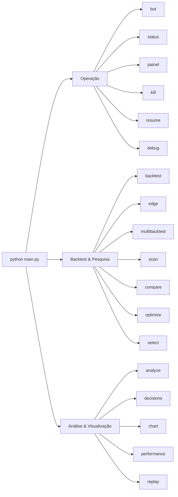

# 08 — Comandos CLI

[← Sumário](README.md)

Todo comando é `python main.py <comando>`. Sem argumento, o padrão é `bot`. Comandos têm aliases em português onde faz sentido (`analyze`/`analisar`, `decisions`/`decisoes`, `optimize`/`otimizar`, `select`/`selecionar`, `compare`/`comparar`, `performance`/`desempenho`).



## Operação

| Comando | Descrição |
|---|---|
| `python main.py bot` | Inicia o loop principal, multi-par, poll a cada 60s |
| `python main.py status` | Patrimônio (caixa/posições/total), PnL, circuit breaker e kill switch |
| `python main.py painel` | Patrimônio, posições abertas, últimas operações/sinais e bloqueios recentes numa única tela |
| `python main.py kill` | Ativa o kill switch — suspende novas entradas |
| `python main.py resume` | Desativa o kill switch — retoma novas entradas |
| `python main.py debug [PAR]` | Explica cada condição de entrada (EMA, RSI, MTF, regime, volatilidade, cooldown) pra um par específico |

## Backtest & pesquisa

| Comando | Descrição |
|---|---|
| `python main.py backtest` | Backtest no par principal (`PAIRS[0]`) |
| `python main.py backtest --validate` | Backtest com split treino/validação out-of-sample + veredito |
| `python main.py edge` | Relatório de vantagem estatística contra buy-and-hold |
| `python main.py edge --validate` | Mesmo relatório, mas sobre a fatia de validação out-of-sample (treino e validação lado a lado) |
| `python main.py multibacktest` | Backtest numa lista fixa de pares |
| `python main.py scan` | Backtest nos top 30 pares por volume na Binance |
| `python main.py compare` | Compara múltiplas estratégias/presets lado a lado, mesmos pares/timeframe |
| `python main.py multimarket [SÍMBOLOS...]` | Varre estratégia × símbolo em vários mercados, **exigindo confirmação fora da janela de busca** — ver abaixo |
| `python main.py optimize` | Grid search dos melhores parâmetros |
| `python main.py optimize --walk-forward` | Grid search com validação walk-forward |
| `python main.py select` | Ranqueia candidatos de pares dinâmicos por liquidez, spread e volatilidade |

## Análise & visualização

| Comando | Descrição |
|---|---|
| `python main.py analyze` | Resumo de `data/trades.csv`: win rate, profit factor, expectância, PnL por par e por motivo de saída |
| `python main.py decisions` | Resume `data/decisions.csv`: sinais, bloqueios e indicadores médios (ex: RSI) por sinal |
| `python main.py chart [PAR] [TF]` | Gráfico interativo no navegador (Dash/Plotly): candlestick, EMAs, RSI, marcadores de sinal e de trades reais |
| `python main.py performance` | Curva de capital, drawdown e PnL por par a partir de `data/trades.csv`, HTML no navegador |
| `python main.py replay [PAR]` | Roda o caminho de decisão **real** de produção sobre histórico, isolado — nunca toca os arquivos reais (ver [10 — Observabilidade](10-observabilidade.md)) |

## `multimarket` — varredura com confirmação fora da amostra

```bash
python main.py multimarket AAPL EURUSD=X ES=F BTC/USDT
python main.py multimarket              # usa RESEARCH_SYMBOLS do .env
```

Aceita símbolos de qualquer mercado — o mercado é deduzido do formato (`AAPL` → ações EUA, `PETR4.SA` → ações BR, `EURUSD=X` → forex, `ES=F` → futuros, `^GSPC` → índice, `BTC/USDT` → cripto).

**Por que existe separado do `compare`**: a pergunta é outra. O `compare` mostra como cada combinação se saiu; o `multimarket` responde se alguma **se sustenta fora da janela onde foi descoberta**.

Isso importa porque testar N estratégias × M símbolos produz aprovações por acaso. Com o profit factor mediano observado neste projeto (0,60), é matematicamente esperado que algumas passem por sorte. Sem dividir as janelas, sorte vira "achado".

| Status | Significado |
|---|---|
| `confirmado` | Passou também na janela de confirmação — a única leitura que conta como aprovação |
| `so na busca` | Passou onde foi descoberto e **não** se sustentou fora. **Não é aprovação** |
| `reprovado` | Não passou em nenhuma das duas |
| `inconclusivo` | Histórico insuficiente para dividir as janelas — nunca aprovado por omissão |

A tabela é ordenada por **status antes de retorno**: um resultado confirmado modesto vale mais que um espetacular não confirmado. Ordenar por retorno colocaria o segundo no topo, que é precisamente a leitura errada.

O cabeçalho mostra quantas combinações foram avaliadas — uma aprovação entre 200 tentativas tem peso estatístico diferente de uma entre 3.

Símbolos de mercado com pregão descontínuo levam `*`: o teto de perda por trade não age dentro de um gap de abertura.

## Saída de cada comando

A maioria dos comandos de backtest/scan/optimize também grava um relatório auditável em `reports/{comando}_{timestamp}.{json,csv,md}` — ver [09 — Persistência de Dados](09-persistencia-dados.md).

## Próximo capítulo

[09 — Persistência de Dados](09-persistencia-dados.md) detalha exatamente o que cada comando lê e escreve em disco.
