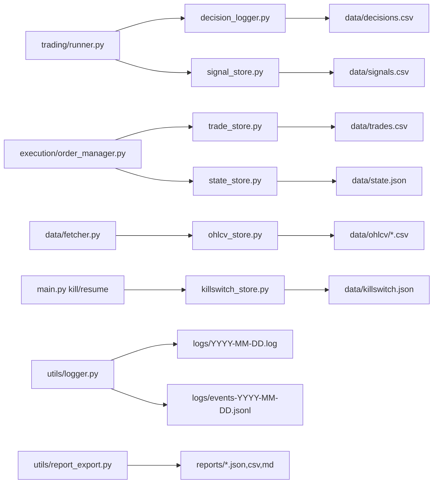

# 09 — Persistência de Dados

[← Sumário](README.md)

Tudo em disco, sem banco de dados — CSV, JSON e JSONL, todos sob `data/`, `logs/` e `reports/`. Escrita atômica (`data/atomic_io.py`) evita corrupção se o processo morrer no meio de uma gravação.

## Quem escreve o quê

## Tabela de referência

| Arquivo | Formato | Conteúdo |
|---|---|---|
| `data/decisions.csv` | CSV | Cada ciclo, por par: sinal, decisão final, bloqueios, filtros e todos os indicadores calculados |
| `data/signals.csv` | CSV | Só mudanças de sinal (HOLD→BUY, BUY→SELL, etc.) — não grava em todo poll |
| `data/trades.csv` | CSV | Cada trade fechado: entrada, saída, quantidade, PnL (USDT e %), motivo, saldo após, `client_order_id` |
| `data/ohlcv/{PAR}{TF}.csv` | CSV | Candles históricos acumulados — cache persistente entre execuções |
| `data/state.json` | JSON | Saldo, posições abertas, cooldowns, contadores de drawdown/circuit breaker, ordens pendentes |
| `data/killswitch.json` | JSON | Flag do kill switch — arquivo próprio, fora do `state.json` de propósito (ver [06](06-protecoes-operacionais.md)) |
| `logs/YYYY-MM-DD.log` | texto | Log textual completo do dia, colorido no terminal / plano no arquivo |
| `logs/events-YYYY-MM-DD.jsonl` | JSONL | Eventos estruturados: ordens, erros, circuit breaker, reconciliação, ciclo operacional |
| `reports/{comando}_{timestamp}.{json,csv,md}` | JSON/CSV/Markdown | Histórico auditável de cada execução de `backtest`/`scan`/`multibacktest`/`optimize` — parâmetros, período, métricas, ranking |

## `data/decisions.csv` — o arquivo mais denso

Uma linha por par, por ciclo, sempre — não só nas mudanças de sinal (esse é `signals.csv`). Contém timestamp, preço, sinal, decisão final, motivo do bloqueio (se houver), e o valor de **todos** os indicadores calculados naquele candle (EMA rápida/lenta/tendência, RSI, MACD, ATR, ATR ratio, ADX, regime, volume/volume_ma, Bollinger). É a fonte de dados de `python main.py decisions` e de qualquer análise post-mortem de por que um par ficou em HOLD.

## `data/state.json` — o que sobrevive a um restart

O bot **restaura estado automaticamente** ao reiniciar (`OrderManager._restore_state()`): saldo paper, posições abertas (com SL/TP/trailing/ATR já calculados), cooldowns, contadores de drawdown por período (com verificação se o período ainda é o atual — vira o dia/semana/mês e o contador reseta), circuit breaker (incluindo o novo `circuit_breaker_triggered_at`, ver [06](06-protecoes-operacionais.md)), e ordens pendentes (`pending_open_client_order_ids`, `pending_limit_orders`) para retomar idempotência em live sem duplicar ordens.

## Cache de candles (`data/fetcher.py`)

Cache em memória (`_cache` dict), não persistido em disco à parte de `data/ohlcv/*.csv`:

- **Primeira chamada:** busca `CANDLE_LIMIT=1000` candles por par
- **Chamadas seguintes:** busca só os candles novos desde o último fechado e faz merge — evita latência repetida (~5s por chamada completa na Binance a partir do Brasil)

## Próximo capítulo

[10 — Observabilidade](10-observabilidade.md) mostra como consumir esses dados: `painel`, `debug`, `performance`, `replay` e a análise de `decisions.csv`.
