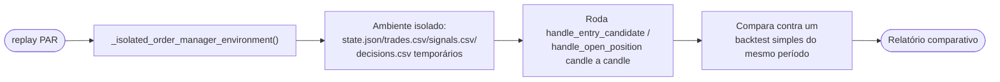

# 10 — Observabilidade

[← Sumário](README.md)

Comandos para investigar **por que** o bot fez (ou não fez) alguma coisa, sem precisar ler CSV cru.

## `python main.py painel`

Agrega numa única tela: patrimônio (`trading/portfolio.py::compute_portfolio_snapshot()` — caixa livre, valor em posições ao preço atual, patrimônio total, PnL realizado/não-realizado/total), posições abertas, últimas operações (`data/trades.csv`), últimos sinais (`data/signals.csv`) e bloqueios recentes. Histórico ausente ou vazio vira estado explícito em cada seção ("nenhuma operação ainda") — nunca erro.

Se o preço de uma posição não puder ser obtido, todos os campos agregados que dependem dele retornam `None` propagado — nunca um `$0.00` silencioso que pareceria uma posição zerada de verdade.

## `python main.py debug [PAR]`

Estende os checks internos da estratégia (`strategy/diagnostics.py::full_diagnosis()`) mostrando o valor de **cada condição individual** de entrada: cruzamento de EMA, RSI vs limites, volume vs média, Bollinger, MTF, regime, volatilidade, cooldown. Serve pra responder "por que ORCA/USDT está em HOLD agora" sem precisar decifrar `decisions.csv` na mão.

## `python main.py decisions`

Resume `data/decisions.csv` (via `data/decisions_analysis.py`): contagem de sinais por tipo, bloqueios mais comuns, e indicadores médios agrupados por sinal — por exemplo, RSI médio quando o sinal foi `BUY` vs `SELL` vs `HOLD`.

## `python main.py performance`

Curva de capital, drawdown e PnL por par, calculados a partir de `data/trades.csv` (`backtesting/performance_charts.py`), HTML combinado aberto no navegador. Complementa `python main.py chart`, que ganha uma camada de marcadores de trades **reais** — distinta dos marcadores teóricos de sinal que o chart já mostrava.

## `python main.py replay [PAR]`

O mais elaborado dos comandos de observabilidade. Roda o **caminho de decisão real de produção** — as mesmas funções `handle_entry_candidate`/`handle_open_position` usadas pelo loop de 60s (`trading/runner.py`) — candle a candle sobre histórico público. Não é a simulação simplificada de `backtesting/engine.py`; é o código de produção de verdade, só que alimentado com dados históricos.

**Isolamento garantido** via `_isolated_order_manager_environment()`: nunca toca os arquivos reais de produção (`data/state.json`, `trades.csv`, `signals.csv`, `decisions.csv`), nunca envia ordem real, nunca dispara Telegram real — independente do `TRADING_MODE` configurado no `.env`, mesmo em caso de erro no meio da execução.

**Limitações conhecidas**, documentadas de propósito em vez de escondidas: cooldown usa o relógio real (não point-in-time do histórico simulado), o MTF não é point-in-time, e os resets de drawdown diário/semanal/mensal e o timeout do circuit breaker também usam relógio real — um replay de meses de histórico roda em segundos, então esses períodos raramente viram de verdade durante a simulação (podendo entender bloqueios em janelas de perda mais longas do que o bot real produziria). São aproximações aceitas porque o objetivo é uma leitura *suplementar* e imediata, não substituir semanas de paper mode real — corrigir isso de verdade exigiria rotear tempo simulado por toda a cadeia de decisão de produção, risco desproporcional ao ganho de precisão de uma ferramenta de diagnóstico. `replay` não é a mesma coisa que "comparar paper vs backtest" de forma definitiva — é uma aproximação parcial desse objetivo.

## `python main.py status`

O mais simples e mais usado no dia a dia: patrimônio, PnL, estado do circuit breaker e do kill switch. Ver [06 — Proteções Operacionais](06-protecoes-operacionais.md) pro que cada estado significa.

## Exportação de relatórios (`utils/report_export.py`)

`backtest` (incluindo `--validate`), `scan`, `multibacktest` e `optimize` (incluindo `--walk-forward`) salvam o resultado completo em `reports/{comando}_{timestamp}.{json,csv,md}` — timestamp no nome evita sobrescrever execuções anteriores, criando um histórico auditável de toda vez que a estratégia foi testada.

## Próximo capítulo

[11 — Deploy em Produção](11-deploy-producao.md) cobre como rodar isso tudo 24/7 num servidor, sem depender de um terminal aberto.
