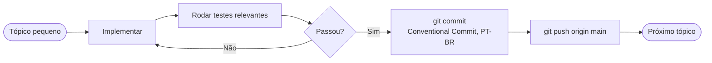

# 12 — Desenvolvimento

[← Sumário](README.md)

## Fluxo incremental

Para qualquer mudança não trivial, o trabalho é separado em tópicos pequenos. Ao terminar cada tópico:



Artefatos de runtime (`data/*.csv`, `data/state.json`, `logs/`, `reports/`) nunca são commitados.

## Padrão de commits

Todo commit tem título e corpo:

- **Título:** `tipo: descrição curta` (máx 72 chars) — ex: `feat: adicionar filtro de volatilidade`
- **Corpo:** o que mudou e por quê — decisões e contexto relevante pra leitura futura

| Tipo | Uso |
|---|---|
| `feat:` | nova funcionalidade |
| `fix:` | correção de bug |
| `docs:` | documentação |
| `refactor:` | reestruturação sem mudança de comportamento |
| `test:` | testes |
| `chore:` | tooling/config |

## Hooks de pre-commit

`.pre-commit-config.yaml` roda três hooks antes de qualquer commit ser aceito:

1. `ruff` (lint, com `--fix`)
2. `mypy`, restrito a `risk/manager.py` e `execution/order_manager.py` — os dois módulos mais sensíveis a erro de tipo silencioso (cálculo de dinheiro)
3. `pytest` — suíte inteira, sempre (`always_run: true`)

```bash
pip install -r requirements-dev.txt
pre-commit install
```

## Testes

```bash
pytest                          # suíte inteira
pytest tests/test_order_manager_safety.py -q   # um arquivo específico
pytest -k "circuit_breaker"     # por nome
```

Convenção do projeto: testes que envolvem `OrderManager` usam `monkeypatch.setattr(order_manager, "NOME_DA_CONSTANTE", valor)` para sobrescrever configs importadas do `config/settings.py` sem precisar de um `.env` de teste separado — ver exemplos em `tests/test_order_manager_safety.py`.

## Adicionar uma estratégia nova

1. Criar `strategy/minha_estrategia.py` herdando `BaseStrategy` (`strategy/base.py`)
2. Implementar `calculate_indicators(df: pd.DataFrame) -> pd.DataFrame`
3. Implementar `generate_signal(df: pd.DataFrame) -> TradeSignal`
4. Trocar a instância em `trading/runner.py` e `backtesting/engine.py`

```python
from strategy.base import BaseStrategy, TradeSignal, Signal

class MinhaEstrategia(BaseStrategy):
    def calculate_indicators(self, df):
        # adicionar colunas ao df
        return df

    def generate_signal(self, df):
        # retornar TradeSignal(Signal.BUY/SELL/HOLD, price, reason)
        ...
```

Se a estratégia nova introduzir um filtro opcional aditivo (como `REGIME_FILTER_ENABLED`, `HIGH_VOLATILITY_FILTER_ENABLED`), ele precisa ser aplicado **nos dois caminhos**: o caminho por candle (`generate_signal`) e o vetorizado (`precompute_signals`, usado por `optimize`/`backtest --validate`/`optimize --walk-forward`) — os dois precisam ficar sincronizados sempre que um filtro novo entrar, senão o backtest valida um comportamento que a produção não replica.

## Dependências principais

| Pacote | Uso |
|---|---|
| `ccxt` | Conexão com exchanges (Binance, etc.) |
| `pandas` | Manipulação de séries temporais |
| `ta` | Indicadores técnicos (EMA, RSI, MACD, ATR, ADX, Bollinger) |
| `python-dotenv` | Leitura do `.env` |
| `colorlog` | Logs coloridos no terminal |
| `rich` | Tabela multi-par e display no terminal |
| `requests` | Notificações Telegram |
| `plotly` / `dash` | Gráfico interativo e servidor web local |

## Sincronização CLAUDE.md ↔ AGENTS.md

`CLAUDE.md` (português) e `AGENTS.md` (inglês) precisam ter sempre o mesmo conteúdo. Ao modificar qualquer seção num arquivo, atualize o equivalente no outro **no mesmo commit** — são o mesmo contrato de comportamento do projeto, só em dois idiomas para agentes de IA diferentes.

## Próximo capítulo

[13 — Metodologia SDD](13-metodologia-sdd.md) explica como decisões maiores de escopo (o que construir, em que ordem) são tomadas neste projeto.
