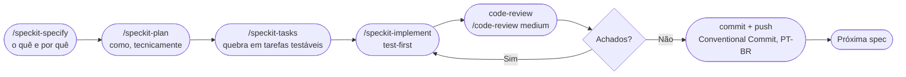

# 13 — Metodologia SDD

[← Sumário](README.md)

Mudanças de escopo maior (não bugfixes pontuais) seguem **spec-driven development** via [GitHub Spec Kit](https://github.com/github/spec-kit), documentado em `specs/`.

## O ciclo

Cada spec vira uma pasta em `specs/NNN-nome-curto/` com o histórico completo — não é descartado depois de implementado, fica como registro de decisão.

## Autonomia — a distinção que organiza o backlog (`specs/BACKLOG.md`)

| Categoria | Significado |
|---|---|
| **Sozinho** | Especificável, implementável, testável (inclusive contra dados reais públicos da Binance) sem depender de nada que só o operador tem ou decide |
| **Parcial** | A maior parte é código construível sozinho, mas uma fatia específica exige o operador — tipicamente, rodar em paper mode por dias/semanas (tempo real passando não é simulável) |
| **Bloqueado** | Depende de uma decisão do operador antes de começar (dinheiro real, preferência de produto) — não deve ser puxado da fila sem essa decisão |

Essa distinção evita um erro comum: tentar "terminar" uma spec **Parcial** escrevendo mais código quando o que falta de verdade é tempo real decorrido, não implementação.

## Histórico — specs concluídas

| # | Spec | O que resolveu |
|---|---|---|
| 001 | Hardening Incremental | Idempotência, reconciliação, circuit breaker/kill switch, validação out-of-sample |
| 002 | Decisão de aprovação multi-par | Critérios de aprovação e ranking de pares além de um par por vez |
| 003 | Otimização sem overfitting | Split treino/validação e walk-forward no `optimizer.py` |
| 004 | Métricas de risco avançadas | Sortino, Calmar, tempo em posição, retorno anualizado |
| 005 | Proteções finais para live | Confirmação explícita de sessão live, checagem de liquidez, ordens limit, limites semanal/mensal |
| 006 | Evolução da estratégia | Bollinger adaptativo, regime ADX, volatilidade elevada, `BreakoutStrategy`, comando `compare` |
| 007 | Observabilidade operacional | `painel`, `debug`, `performance`, exportação de relatórios |
| 008 | Replay acelerado | `python main.py replay` — caminho de decisão real sobre histórico, isolado |
| 009 | Itens remanescentes do ROADMAP | Indicadores médios por sinal, edge out-of-sample, diagnóstico de perfil agressivo |
| 010 | Paridade de custos paper/backtest | `_paper_buy`/`_paper_sell` passaram a aplicar fee/slippage — corrigiu PnL de paper mode sistematicamente ~0,3%/round-trip otimista demais |
| 011 | Rate limit hardening | Singleton de exchange + retry/backoff em `data/fetcher.py` e `backtesting/scanner.py` |

Specs 010 e 011 nasceram de uma **auditoria completa do projeto** (código + pesquisa externa de boas práticas) feita depois que 001-009 estavam concluídas — prática recomendada: mesmo com o backlog "zerado", vale uma auditoria periódica para achar gaps que ninguém tinha pedido explicitamente.

## O que ainda está pendente

- **006 e 007 (parte "Parcial")**: "validar preset operacional atual" e forward test formal — bloqueados em tempo real de paper mode, não em código. Ver [11 — Deploy em Produção](11-deploy-producao.md) para a infraestrutura que acumula esse tempo.
- **012** (candidata): MTF fail-closed + profundidade de liquidez próxima ao preço — ver [04](04-gestao-risco.md#bloqueadores-de-entrada) e [05](05-execucao-ordens.md#checagem-de-liquidez-executionliquiditypy).
- **013** (candidata): risco de correlação entre posições simultâneas — `MAX_POSITIONS` limita quantidade, não exposição correlacionada entre pares que se movem juntos.
- **014** (candidata, baixa urgência): refresh periódico de pares dinâmicos.
- **015**: avançado (ML, multi-exchange) — intencionalmente fora da fila até o resto amadurecer.

Status sempre atualizado em `specs/BACKLOG.md` — trate este capítulo como um resumo de orientação, não como a fonte mais recente.

## Por que documentar isso

Um projeto que decide o que construir a partir de specs revisáveis, não de intuição solta, deixa rastro de **por que** cada decisão foi tomada — útil tanto para quem retoma o projeto depois de meses quanto para auditar se uma mudança de estratégia foi validada de verdade antes de ir pra produção real.
