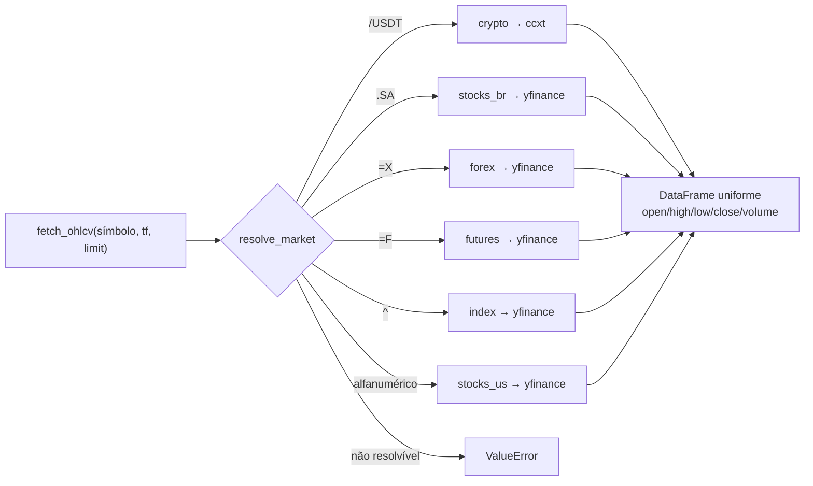
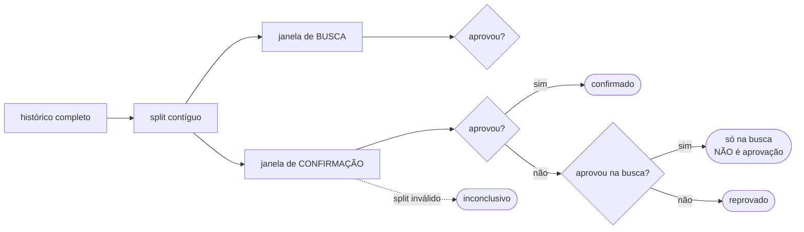

# 14 — Multi-mercado (pesquisa)

[← Sumário](README.md)

O bot **opera** exclusivamente cripto na Binance. Desde a spec 023 ele consegue **avaliar** estratégias em ações, forex, futuros e índices — capacidade de medição, não de operação.

## Por que existe

Oito dias de medição estabeleceram que a estratégia EMA/RSI não tem vantagem preditiva em cripto: profit factor mediano `0,60`, paper mode negativo, e uma grade de 648 combinações de parâmetros cujo melhor resultado foi `+0,23%` em ~333 dias.

A pergunta natural era: *"e em outro mercado?"* — e não havia como responder, porque o bot só enxergava cripto. Construir corretora e execução para ações só pra descobrir isso seria caro. Esta camada responde antes de investir.

## Mercados suportados

O mercado é deduzido do **formato do símbolo** — você não informa qual é.

| Mercado | Exemplo | Fonte | Contínuo | Operável |
|---|---|---|---|---|
| `crypto` | `BTC/USDT` | ccxt | sim | **sim** |
| `stocks_us` | `AAPL` | yfinance | não | não |
| `stocks_br` | `PETR4.SA` | yfinance | não | não |
| `forex` | `EURUSD=X` | yfinance | sim | não |
| `futures` | `ES=F` | yfinance | não | não |
| `index` | `^GSPC` | yfinance | não | não |

`fetch_ohlcv()` **não mudou de assinatura** — os ~10 consumidores (backtest, compare, scan, optimize, validation, replay, runner, chart, selector, diagnostics) continuam chamando igual e não sabem qual fonte respondeu.

## Duas listas separadas, de propósito

| Variável | Alimenta | Validação |
|---|---|---|
| `PAIRS` | loop ao vivo | estrita: todo símbolo deve terminar em `/USDT` |
| `RESEARCH_SYMBOLS` | pesquisa | qualquer símbolo resolvível |

Não é uma lista com validação relaxada porque afrouxar `PAIRS` reabriria o caminho para um ticker de ação chegar ao caminho de execução — que só sabe operar cripto. `trading/runner.py::assert_pares_operaveis()` recusa a inicialização se isso acontecer, nomeando todos os problemáticos de uma vez.

## Custo por mercado

Cada mercado tem taxa e slippage próprios (`MARKET_COST_PROFILES`). **Mercado sem perfil declarado é recusado**, nunca avaliado com o custo de outro.

Isso não é preciosismo: foi o mecanismo inverso — slippage de par ultralíquido aplicado a book fino — que fez ACE, BIO e ALLO parecerem operáveis no backtest e entregarem prejuízo real em paper mode.

Mercados com **corretagem fixa** (ações, futuros) são representados por um percentual equivalente ao tamanho de ordem configurado. `source_note` registra essa aproximação em cada perfil: precisa para triagem, imprecisa para dimensionamento fino.

Cripto não tem perfil próprio — reusa `BACKTEST_FEE_RATE`/`BACKTEST_SLIPPAGE_PCT` diretamente, garantindo que passar pela camada nova não altere o resultado do backtest cripto.

## Duas limitações que o resultado sinaliza

**Histórico menor.** A fonte não-cripto limita histórico intradiário a **730 dias** — cerca de 993 candles em 4h, contra 2.000 de cripto. Pedir 2.000 e receber 993 é normal, mas passar silencioso desbalancearia uma comparação. Por isso `requested_candles` é registrado e a lacuna é logada.

**Gap de abertura.** Mercados descontínuos marcam `has_session_gaps`. O teto de perda por trade (`MAX_STOP_LOSS_PCT`, 8%) **não age dentro de um gap** — se o papel abre 15% abaixo, o preço salta o stop. Modelar isso exigiria simular execução em mercado com pregão, fora do escopo desta camada; a alternativa honesta é marcar o resultado.

## Confirmação fora da amostra

O comando `python main.py multimarket` existe para um problema específico: **testar muitas combinações produz aprovações por acaso.**

Com profit factor mediano de 0,60, é matematicamente esperado que algumas combinações passem por sorte numa varredura. A regra: uma combinação só é **confirmada** se passar numa janela que não participou da sua descoberta.

Reusa `split_train_validation()` e `evaluate_approval()` já existentes — nenhum critério de aprovação novo foi inventado.

## O que a primeira varredura mostrou

2 estratégias × 5 símbolos = **10 combinações, zero confirmadas fora da amostra.**

Dois casos ilustram por que o guarda-corpo importa:

| Combinação | Janela de busca | Janela de confirmação |
|---|---|---|
| PETR4.SA / Breakout | +0,72% | **0 trades** |
| ES=F / EMA-RSI | +0,35% | PF 1,62 — ainda abaixo do mínimo |

Sem a divisão das janelas, os dois entrariam num relatório parecendo achado. É o mesmo erro que quase se cometeu ao adicionar DOGE, ZEC, ADA e UNI com base numa régua quebrada (ver [13 — Metodologia SDD](13-metodologia-sdd.md)).

**A conclusão**: nenhum dos cinco mercados sustentou vantagem com essas estratégias. Isso tem valor concreto — evita meses construindo execução para ações ou forex atrás de um edge que não existe.
